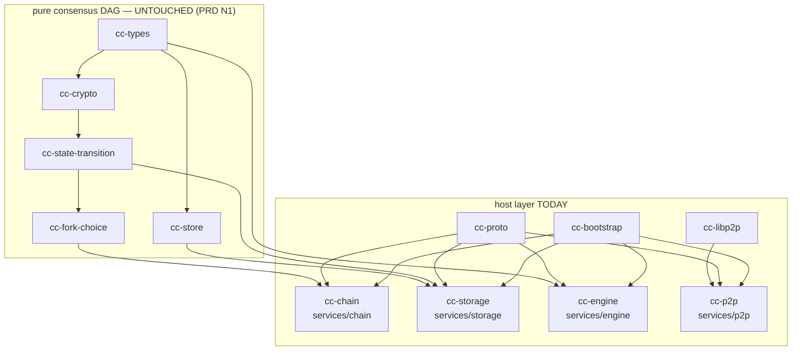
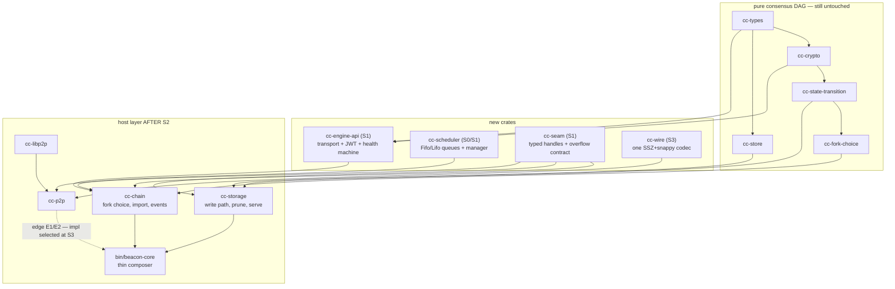

# Architecture — `beacon-core`: the spine, the seams, and the one decision we are not making

**Repo:** `dsrvlabs/eth-client-monorepo` · **Branch:** `develop` (`4146791`) · **Date:** 2026-08-15
**Status:** proposed · **Governs:** the refactoring program specified by `plan/prd.md`

**Source documents:**

| Ref | Document | Role |
|---|---|---|
| **[PRD]** | `plan/prd.md` | **Normative.** 129 requirements, the `Disposition` vocabulary (§5.0), framing decisions D-1…D-6, the open p2p-endpoint decision (§9), source disagreements (§10) |
| **[AS]** | `architecture-study-2026-08-12.md` | 25-agent architecture study — §2 topology, §4 ledger, §7 judge panel, §8 six-stage migration, §9 keep-&-watch |
| **[RV]** | `review-develop-2026-08-09.md` | multi-agent code review of `develop` |
| **[q1]** | `plan/research/q1-beacon-processor.md` | Lighthouse `beacon_processor` |
| **[q2]** | `plan/research/q2-milhouse.md` | milhouse / tree-states |
| **[q3]** | `plan/research/q3-pubkey-cache.md` | pubkey cache |
| **[q4]** | `plan/research/q4-slashing-db.md` | EIP-3076 slashing DB |
| **[q5]** | `plan/research/q5-fork-seam.md` | fork seam — landed and trimmed during authoring; §5 is written against the trimmed file and re-verifies its load-bearing claims. See §5.0. |
| **[qR]** | `plan/research/README.md` | research index + four cross-cutting findings; all four are folded in (§4.2, §5.4a, §5.5, §9.1) |

> **Research-brief revisions.** All five briefs plus `research/README.md` were revised
> between 16:55 and 17:03, while this document was being written. Re-read afterwards and
> reconciled: **q1's verdict is unchanged** (Loop B now, Loop A after S3) — §3 and §3.8 stand.
> **q3 strengthened**: the pubkey-cache failure is *not* latent behind the dead gossip wiring
> (§4.2 ⟡ D-15). **q4 changed materially**: **redb over SQLite**, and **store the complete
> condition set while exporting the minimal one** — §9.1 S5 and ADR-R-05 follow the revised
> text. **q5 was trimmed and its §3.2 corrected**: Lighthouse dispatches the STF by *monotone
> capability predicates*, not by enum match and not by per-fork modules — §5.4c ⟡ D-16 is
> written against the correction, and section numbers cited as `[q5] §n` are the trimmed
> file's. Anyone re-reading a brief should diff it against these four statements before
> assuming this document is current.

### Conventions used in this document

| Mark | Meaning |
|---|---|
| **✓** | Re-verified against the working tree at `4146791` on 2026-08-15 by reading the cited `file:line`. Method logged in Appendix A. |
| *(unmarked)* | Carried on the authority of [PRD] / [AS] / [RV] / a research brief. Not independently re-derived here. |
| **⟡** | A judgment call this document makes where the sources do not cover the question, or where this document **disagrees** with a source. Same discipline as [PRD] §10. Every ⟡ is repeated in Appendix B. |

> **What this document is.** A target structure and a seam inventory, plus the mechanics
> that let each stage ship. It is deliberately **not** a final topology: [PRD] D-2/§9 keeps
> the p2p endpoint open and this design keeps both endpoints one mechanical stage apart
> throughout (§2.5). If you read a sentence here that says "at S3 we delete the p2p
> process," it is a defect — report it. The correct sentence is "at S3 we *select the
> transport impl* behind an already-typed handle, and X1–X5 decide which."

---

## 0. The one-page picture

```
                     TODAY — 6 binaries, 8 internal gRPC edges
       (arrows point client → server; ◄─► = bidi stream; ✗ = dead as wired)

                         E8 EngineStream (bidi)
              ┌──────────────────────────────────────────┐
              │            engine dials p2p              │
              ▼                                          │
        ┌───────────┐                              ┌───────────┐         JWT
        │    p2p    │                              │  engine   │◄────────────────►  geth
        │   :9002   │                              │   :9004   │   the one real
        └─┬───┬───┬─┘                              └───────────┘   trust boundary
          │   │   │                                      ▲
   E1 ✗   │   │   │ E5 ✗ PutBackfillBatch                │ E3  NewPayload / fcU
   P2pStream  │   │ E6 ✗ WatchServeWindow + serve reads   │     FetchBlobs
   (bidi) │   │   │                                      │     ── no deadline ──
          │   │   ▼                                      │
          │   │  ┌──────────────────────────────┐        │
          │   │  │        storage :9006         │        │
          │   │  │ write-behind · redb · prune  │        │
          │   │  └───┬──────────────────────┬───┘        │
          │   │      │ E4 RestoreFromStore  │ E7         │
          │   │      │    (boot, unauth)    │ SubscribeEvents
          │   │      │                      │ (bulk data plane)
          ▼   ▼      ▼                      ▼            │
        ┌────────────────────────────────────────────────┴──┐
        │                    chain :9001                    │
        │   fork choice · import · event ring (4096/64MiB)   │
        └───────────────────────────────────────────────────┘
          ▲ E2 ✗ DataAvailable (a P2pStream oneof arm)

                  AFTER S2 — 2 processes, 1 internal edge

     ┌────────┐   E1/E2/E8 typed handles (ChainIngress / P2pEgress)  ┌──────────────────┐
     │  p2p   │◄───────────────────────────────────────────────────► │   beacon-core    │
     │        │   transport impl UNDECIDED — [PRD] §9 X1–X5          │  chain+storage+  │──►geth
     │        │   (in-proc mpsc | unix socket | gRPC)                │  engine, one redb│  JWT
     └────────┘                                                      └──────────────────┘
                  E3 E4 E5 E6 E7 deleted · E8 folds into E1's egress half
```

The program's whole risk is concentrated in one sentence: **five of the eight *edges*
(E3–E7) are deleted by moving code, and deleting a transport silently rewrites its
backpressure contract** ([PRD] R-1). §2 is the discharge of that risk and is the most
important section here.

> To be explicit, because the arithmetic collides: "five of eight edges" is **not** [AS]
> §1's "five of the eight high-severity findings," which [PRD] §10/J-1 shows does not hold
> against [AS]'s own §4 ledger. This document never makes that claim. The deletion set is
> stated by ledger disposition in §2.3, where exactly **one** [AS] §4 High row (03) is
> deleted rather than patched.

---

## 1. Target module structure for `beacon-core`

### 1.1 The asset, and the enforcement mechanism that protects it

[PRD] N1 forbids rewriting the pure crate DAG. That constraint is currently enforced not
by Cargo but by a hand-maintained allowlist in `scripts/check-crate-dag.sh` — an
`allowed_deps()` case statement over workspace member names, run inside the `clippy` CI
job ✓ (`scripts/check-crate-dag.sh:105-135`; job wiring per `docs/contracts.md:457`). The
same script carries four further **named prohibitions** that are architecture, not style ✓:

| Rule | Script location | What it makes impossible |
|---|---|---|
| `cc-store` may depend on `cc-types` and nothing else, permanently | `check-crate-dag.sh:60-80` | storage's key-value layer growing consensus dependencies |
| `crates/store/src` must not name `SignedBeaconBlock`/`BeaconState`/`DataColumnSidecar` | `:83-92` | the opaque-bytes-under-typed-keys rule decaying |
| `services/storage` may never depend on `cc-fork-choice` | `:48-58` | storage re-deriving consensus verdicts |
| only `cc-engine` may declare `reqwest`/`hyper`/`jsonwebtoken`/`hmac` | `:200-260`, `:31-46` | "the JWT never enters the consensus process" |
| only `cc-libp2p` may declare `libp2p*`, pinned to one 40-hex rev | `:160-200` | the git-pinned stack leaking into consensus crates |

**⟡ D-1. Cargo cannot enforce layering between modules inside one crate.** If S1/S2 fold
`services/engine` and `services/storage` into `beacon-core` as *modules*, every rule above
silently stops applying to the folded code — `check-crate-dag.sh` would still pass while
the invariants it exists to protect became unenforceable. Neither [AS] §8 nor [PRD] §5.2
addresses this. **Therefore: the fold is a re-hosting of crates, not a merge of source
trees.** `beacon-core` is a thin binary (`bin/beacon-core`, target < 400 lines) that
composes library crates; every piece that moves stays a crate, and each stage's diff to
`allowed_deps()` is a reviewable, one-line-per-edge statement of what the stage changed.

### 1.2 Crate DAG — before and after

The pure layer is untouched at every stage. Only the host layer changes.



**After S1** (EL bridge folded) and **S2** (storage folded):



The dotted edge is the whole of [PRD] D-2. `cc-p2p` is drawn adjacent to the binary, not
inside it, because **nothing in S0–S2 may depend on which side of a process boundary it
ends up on.**

### 1.3 Where each existing module goes

`services/*` are already thin hosts over library crates ([AS] §8), which is why this table
is mostly moves rather than rewrites. Line counts are from the tree ✓.

**`services/engine` (S1) → `crates/engine-api` + deletions**

| Module | Destination | Note |
|---|---|---|
| `transport.rs`, `jwt.rs`, `state.rs`, `version.rs`, `errors.rs`, `capabilities.rs` | `crates/engine-api/src/` verbatim, with tests | The three-lane transport + JWT + health machine. [AS] §8 S1. |
| `methods/{new_payload,fcu,get_blobs,eth_syncing,capabilities}.rs` | `crates/engine-api/src/methods/` | `new_payload.rs:311` `hex_to_32` panic ([PRD] P2-A) rides along |
| `fastpath/{cells,fetch,filter,sidecars}.rs` | `crates/engine-api/src/fastpath/` | Arrives with **real** KZG; `main.rs:135` `kzg: None` ([PRD] P1-A/25) and `main.rs:133` `hoodi_blob_bound()` test fixture ([PRD] P1-A/26) are fixed *by* the move, since the binary that passed them ceases to exist |
| `config.rs` (`ElForksConfig`, `TransportTimeouts`) ✓ (`services/engine/src/config.rs:143-170`) | `crates/engine-api/src/config.rs` | `osaka_time` fail-open default ([PRD] P2-D/19) is patched here at S1 |
| `inject.rs`, `service.rs`, `main.rs`, `metrics.rs` | **deleted** | `service.rs` is the gRPC shell; `inject.rs` is the p2p-stream client half of E8 |
| — | `services/chain/src/engine_client.rs` **deleted** | The whole `Handle::block_on` bridge ✓ (`engine_client.rs:91,141,166,178,196,234`) disappears with the process boundary. See §4.2. |

**`services/storage` (S2) → `crates/storage-core`**

| Module | Destination | Note |
|---|---|---|
| `writer.rs`, `resume.rs`, `durable_set.rs`, `history.rs`, `migrate.rs` | `crates/storage-core/src/` verbatim | Single-writer discipline survives ([PRD] N3) |
| `prune/{mod,blocks,chunk,columns,shards,states}.rs` | `crates/storage-core/src/prune/` | [PRD] P1-A/6, P2-A prune rows ride along |
| `replay.rs` | `crates/storage-core/src/replay.rs` | `replay.rs:354` multi-second CPU on the reactor ([PRD] P1-B/3) becomes a `spawn_blocking` at the fold |
| `serve.rs` | **split**: read path → `crates/storage-core/src/serve.rs`; the `PutBackfillBatch` handler → deleted | The handler's unauthenticated canonical-index rewrite ([RV] Vuln 2) is deleted with the RPC; the *validation* [PRD] P1-A/1 asks for is still required at S0 because S2 is months away |
| `write_behind.rs` | **deleted** — replaced by a direct call | See §4.3. This deletes [PRD] P1-A/4 and P0-13's surface. |
| `restore_client.rs` | **deleted** | E4 disappears |
| `backfill.rs` | `crates/storage-core/src/backfill.rs` | admission logic kept; the RPC front door deleted |
| `main.rs`, `metrics.rs` | folded into `bin/beacon-core` + `crates/storage-core/src/metrics.rs` | `main.rs:352` build-machine fixture path ([PRD] P1-A/5) is a **`patch @ S0`** row and must not wait for this |
| `test_tmpdir.rs` | `crates/storage-core/src/test_tmpdir.rs`, `#[cfg(test)]`-gated | Currently a production module |

**`services/chain` → `crates/chain-core`** (mostly in place; the deletions are the point)

| Module | Fate | Stage |
|---|---|---|
| `core.rs`, `import.rs`, `head.rs`, `residency.rs`, `epoch_context.rs`, `da.rs`, `apply_attestations.rs`, `invalidation.rs`, `pending_engine.rs`, `fcu_driver.rs`, `checkpoint_sync.rs` | move as-is | S2 |
| `engine_client.rs` | **deleted**, replaced by a direct `cc-engine-api` call | S1 |
| `restore.rs` | **deleted** (1,227 lines ✓) | S2 — boot reads redb directly (§4.2) |
| `events/{mod,ring,cursor,fanout}.rs` | **demoted**: stays as the *API/observer* event bus, loses its role as storage's data plane | S2 (§4.3) |
| `service.rs` | shrinks to the API surface that survives; `P2pStream` handler moves behind the `cc-seam` handle | S2/S3 |
| `p2p_stream.rs` | becomes the **gRPC impl** of the `cc-seam` traits, one of two | S1 (typed) / S3 (selected) |
| `main.rs` | folded into `bin/beacon-core` | S2 |
| `metrics.rs` (1,575 lines ✓) | replaced by per-work-type derivation (§3.7) | S3 |

**`services/attestation` and `services/beacon-api`** — the two ~85-line stubs are
**deleted at S5**, not consolidated. [PRD] N5 forbids building Phases 5–7 on them.

### 1.4 New crates, and why each is a crate rather than a module

| Crate | Stage | Exists because |
|---|---|---|
| `cc-seam` | **S1** | Holds the typed handle traits and the overflow-semantics contract for every internal edge (§2). It must be a crate so the conformance test-suite (§2.3) can be run against *both* transport impls without either service in scope. |
| `cc-engine-api` | S1 | Keeps `check-crate-dag.sh`'s JWT isolation rule enforceable after the process boundary goes away (§6.2). |
| `cc-scheduler` | S0/S1 | `FifoQueue`/`LifoQueue`/manager skeleton, shared by both loops. [q1] §2.4/5: extract it so it is testable without a swarm or a gRPC server. |
| `cc-wire` | S3 | One SSZ+snappy codec. Today there are **three** hand-rolled copies that already disagree ([AS] 05): `services/p2p/src/reqresp/`, `crates/libp2p/src/ssz_snappy_codec.rs`, `bin/serve-probe/src/codec.rs` ✓. `bin/serve-probe` must **not** take this dependency — ADR P4-12's independence claim is the reason P0-06 exists. |
| `crates/storage-core` | S2 | See §1.1 ⟡ D-1. |
| `crates/chain-core` | S2 | ditto |

### 1.5 Keeping the layering mechanically enforced

Each stage ships a diff to `allowed_deps()`. The rule is: **the allowlist may only be
edited in the same commit that moves the code, and a stage that widens an edge must name
the edge in its commit message.** Concretely:

```diff
  # S1
+ cc-engine-api)        echo "cc-types cc-crypto" ;;
+ cc-seam)              echo "cc-types" ;;
+ cc-scheduler)         echo "" ;;
- cc-chain)             echo "cc-bootstrap cc-config cc-proto cc-types cc-crypto cc-state-transition cc-fork-choice" ;;
+ cc-chain)             echo "cc-bootstrap cc-config cc-proto cc-types cc-crypto cc-state-transition cc-fork-choice cc-engine-api cc-seam cc-scheduler" ;;
- cc-engine)            echo "cc-bootstrap cc-config cc-proto cc-types cc-crypto" ;;   # crate deleted

  # S2
+ cc-storage-core)      echo "cc-types cc-state-transition cc-store cc-seam" ;;
+ cc-beacon-core)       echo "cc-bootstrap cc-config cc-chain cc-storage-core cc-seam" ;;
- cc-storage)           echo "..." ;;                                                   # crate deleted
```

Two script changes are required and are **architecture decisions, not chores** — (1) is
ADR-R-03's subject, (2) is ADR-R-02's:

1. `http_or_jwt_allowed()` currently hardcodes `pkg == "cc-engine"` ✓
   (`check-crate-dag.sh:213-228`). At S1 it must become `cc-engine-api`, and `cc-chain`
   must **not** be added to the grandfather list — see §6.2 for why that is the load-bearing
   half of this change.
2. The `crates/store` "must not name consensus containers" grep ✓ (`:83-92`) should be
   **extended** to `crates/storage-core/src`, not left behind. Storage's opaque-bytes rule
   is what makes the fork seam (§5) cheap; losing it at S2 would be a silent regression.

**Open question ⟡ Q-1.** `check-crate-dag.sh` is a hand-maintained allowlist with 20
members today and ~22 after S2. It has no test that the allowlist is *minimal* — an edge
can be added and never removed. Recommend a `--check-unused` mode that fails when an
`allowed_deps` entry has no corresponding edge in `cargo metadata`. Not scheduled by
[PRD]; sized S.

---

## 2. The seam inventory

This section discharges [PRD] R-1 / constraint C-3. It is the highest-risk mechanic in the
program: **a gRPC `RESOURCE_EXHAUSTED` the caller handles becomes an in-process
`TrySendError` it does not.**

### 2.0 ⟡ D-2: there are eight internal edges, not six

[AS] §2's edge table lists six. Two live edges are missing from it, and both matter:

| Missing edge | Verified | Why the omission matters |
|---|---|---|
| **E7 `storage → chain: SubscribeEvents`** | ✓ `services/storage/src/write_behind.rs:523` calls `subscribe_events`; the module header at `:1` declares itself "the `SubscribeEvents` consumer" | This is the **highest-volume internal edge in the tree** and the subject of [AS] finding 13 / [PRD] P1-D/13 — "the chain event bus doubles as a bulk data plane." [AS] names the finding but leaves the edge out of its own inventory. |
| **E8 `engine ↔ p2p: EngineStream`** | ✓ `proto/eth/p2p/v1/p2p.proto:25`, described in the file as "THE NINTH CONTRACT" at `:20-24` | Carries `InjectColumns` with the `trusted_local` bool that [AS] §1 names as one of the five surfaces fusion deletes. It cannot be reasoned about if it is not in the inventory. |

Consequence for [PRD]: **M10's baseline ("4 of 6 dead, 1 of 6 unauthenticated") is measured
against an incomplete denominator.** The corrected baseline is **8 edges: 4 dead, 4 live,
of which 4 of the 4 live are unauthenticated** (E3 chain→engine, E4 storage→chain,
E7 storage→chain, E8 engine↔p2p — none carries any credential; the JWT sits one hop
further out, on engine↔geth). Recommend M10 be restated on the 8-edge basis.

### 2.1 The typed handle: what it is and where backpressure lives

Every edge gets a trait in `cc-seam` with three properties:

1. **The methods mirror today's proto `oneof` arms**, so the move is mechanical and
   reviewable against the `.proto` file.
2. **The error type is shared with the transport and names the overflow condition
   explicitly.** Not `Result<T, Box<dyn Error>>`, not `Option<T>`.
3. **The overflow policy is stated in the trait's doc contract**, and there is one
   conformance test-suite in `cc-seam` that every impl must pass.

```rust
// crates/seam/src/lib.rs  (shape, not final)

/// Every internal edge fails in exactly these ways. Adding a variant is a
/// contract change and needs an ADR (§10).
#[derive(Debug, Clone, PartialEq, Eq, thiserror::Error)]
pub enum SeamError {
    /// The receiver's bounded queue was full for the whole `send_timeout`.
    /// MUST map to gRPC `RESOURCE_EXHAUSTED` and back. Caller-visible; the
    /// caller is expected to shed, retry or descore — never to ignore.
    #[error("seam queue full after {waited_ms}ms (bound {bound})")]
    Backpressure { bound: usize, waited_ms: u64 },
    /// Receiver is gone (process exited, task aborted, stream torn down).
    #[error("seam peer unavailable: {0}")]
    Unavailable(String),
    /// The request was structurally rejected before any work was done.
    #[error("seam invalid argument: {0}")]
    InvalidArgument(String),
    /// Precondition not met (e.g. NOT_BOOTSTRAPPED).
    #[error("seam failed precondition: {reason}")]
    FailedPrecondition { reason: &'static str },
}

/// p2p → core. The gossip/DA ingress half of E1+E2.
///
/// # Overflow contract
/// `submit_gossip` MUST block up to `IMPORT_SEND_TIMEOUT` (2 s) and then return
/// [`SeamError::Backpressure`]. It MUST NOT silently drop. Implementations that
/// cannot block (e.g. a `try_send` fast path) MUST still surface Backpressure.
#[async_trait]
pub trait ChainIngress: Send + Sync + 'static {
    async fn submit_gossip(&self, obj: GossipObject) -> Result<VerdictResolution, SeamError>;
    async fn notify_data_available(&self, root: Root, slot: Slot) -> Result<(), SeamError>;
}

/// core → p2p. The verdict/publish/view egress half of E1.
///
/// # Overflow contract
/// `publish` is **lossy by design** and returns `Ok(Published::Dropped)` rather
/// than an error when the publish queue is full — this preserves today's
/// behaviour at `services/p2p/src/service.rs:796`. That looseness is a
/// deliberate, recorded decision (ADR-R-02), not an oversight.
#[async_trait]
pub trait P2pEgress: Send + Sync + 'static {
    async fn publish(&self, req: PublishRequest) -> Result<Published, SeamError>;
    fn update_view(&self, view: ChainView);   // ArcSwap store — never blocks, never fails
}
```

**Where backpressure is expressed.** In exactly one place per edge: the bound on the
receiving queue, named as a constant, plus the `send_timeout` on the sending side. Both
are already the house pattern — `COMMAND_CHANNEL_CAPACITY = 64` ✓ (`core.rs:54`),
`IMPORT_SEND_TIMEOUT = 2s` ✓ (`core.rs:57`), and the nine named bounds in
`services/p2p/src/channels.rs:29-45` ✓. The handle does **not** introduce a second bound;
it names the existing one in the trait doc so a reviewer can diff it.

### 2.2 The overflow-semantics preservation table — how a reviewer verifies nothing changed

This is the artifact C-3 asks for. Today's tree has **four distinct overflow policies** on
internal edges, and one of them is a correctness bug. They must be preserved
*individually*; collapsing them to one policy at the fold would be exactly the silent
change [PRD] R-1 predicts.

| Policy | Today's trigger | Today's caller-visible signal | Verified | Post-move trigger | Post-move signal | Conformance test |
|---|---|---|---|---|---|---|
| **A — blocking with deadline** | `cmd_tx.send_timeout(cmd, 2s)` on a 64-deep channel | gRPC `RESOURCE_EXHAUSTED` + `cc_chain_import_rejected_backpressure` bump | ✓ `core.rs:241,278,307,332,365` | same `send_timeout` on the same bound | `SeamError::Backpressure` | `seam::conformance::backpressure_surfaces_after_deadline` — fill the queue, assert the variant **and** that it took ≥ 2 s |
| **B — try_send, drop the *subscriber*** | per-subscriber `mpsc(256)`, `try_send` only | stream terminated with `RESOURCE_EXHAUSTED`; consumer reconnects with cursor | ✓ `services/chain/src/events/mod.rs:34-35`, `:91`, `:599-601` | unchanged for the API/observer bus (§4.3); **N/A** for storage, whose path stops being a stream | same | `events::slow_subscriber_is_terminated_not_stalled` (exists today; keep) |
| **C — try_send, drop the *message*, log** | publish queue → swarm cmd queue full | `error!("cmd queue full; dropping local publish")`, no caller signal | ✓ `services/p2p/src/service.rs:794-797` | unchanged | `Ok(Published::Dropped)` — **now a value, not a log line** | `seam::conformance::publish_drop_is_observable` |
| **D — try_send, drop *silently*** | `SlotTick` into the full 64-deep command channel | **none** — the failure is swallowed | ✓ `services/chain/src/core.rs:527-532` | **deleted.** The tick moves to its own never-shed lane (§3.2) | n/a — the policy ceases to exist | `core::slot_tick_is_never_shed` |

Policy **D** is [PRD] P0-12 and is the proof that this table is not bureaucracy: an untyped
channel bound is currently making a *consensus* decision (drop a clock tick → `store.time`
lags → valid blocks IGNOREd as `future_slot`), and nothing in the type system says so.

**The reviewer's procedure for any PR that moves a transport:**

1. The PR must touch `cc-seam`'s conformance suite or state in its description why not.
2. `cargo test -p cc-seam` must pass against **both** impls (`InProcess` and the surviving
   transport), not one.
3. The diff must show the queue bound moving, not being re-derived. A new numeric literal
   in a moved file is a review-stopper.
4. If the PR changes a row in the table above, it is a **spec change** and needs an ADR
   ([PRD] R-1: "treat any change in overflow behaviour as a spec change requiring an
   explicit decision, not an implementation detail").

### 2.3 Per-edge inventory

| ID | Edge (today) | Contract | Status today | Becomes | Overflow: caller side | Overflow: callee side | Stage |
|---|---|---|---|---|---|---|---|
| **E1** | p2p → chain | `P2pStream` bidi ✓ (`proto/eth/chain/v1/chain.proto:37`) — `GossipObject`/`DataAvailable`/`ColumnSidecar`/`StreamHello` down, `Verdict`/`PublishRequest`/`ChainView` up | **DEAD** — no gossip subscription ✓ (`services/p2p/src/host.rs:1299`, zero senders) | `cc-seam::{ChainIngress, P2pEgress}`; **transport impl undecided** (§2.5) | Policy A on `submit_gossip`; policy C on `publish` | 64-deep core channel; `GOSSIP_BOUND=1024`, `CHAIN_OUT_BOUND=1024`, `PUBLISH_BOUND=256` ✓ (`channels.rs:29-45`) | typed **S1**; impl selected **S3** |
| **E2** | p2p / engine → chain | `DataAvailable` (a `P2pToChain` oneof arm ✓ `p2p.proto:98-104`) | **DEAD** — `NoopSamplingFeed`, `da_tx = None` | folded into `ChainIngress::notify_data_available` | Policy A (fire-and-forget with 2 s deadline ✓ `core.rs:363-374`) | same 64-deep channel; moves to the `import` lane (§3.2) | typed **S1**; wired **S3** ([PRD] P0-16) |
| **E3** | chain → engine | `NewPayload`/`ForkchoiceUpdated`/`FetchBlobs`/`GetEngineState` ✓ (`proto/eth/engine/v1/engine.proto:19-28`) | **LIVE, no deadline** — `handle.block_on` with no timeout ✓ (`engine_client.rs:91,141,166,178,196,234`) | **deleted.** Direct `cc-engine-api` call from the core thread. | n/a — becomes a function call with an explicit `Duration` argument | the EL's own HTTP timeouts, already modelled in `TransportTimeouts` ✓ (`services/engine/src/config.rs:37-67`) | **S1** |
| **E4** | storage → chain | `RestoreFromStore` boot push ✓ (`chain.proto:65`) | **LIVE, boot-only, unauthenticated** — installs consensus state with BLS disabled and attacker-chosen DA verdicts ([RV] §1) | **deleted.** Boot opens redb in-process (§4.2). | n/a | n/a | **S2** |
| **E5** | p2p → storage | `PutBackfillBatch` ✓ (`proto/eth/storage/v1/storage.proto:28`) | **DEAD** — client method absent ✓ | **deleted** as an RPC; becomes `storage_core::backfill::admit()` behind `cc-seam::ArchiveWrite` | Policy A | writer mailbox (three-class priority, ADR P4-04) | **S2**; the admission logic it fronts is wired **S3** ([PRD] P0-17d) |
| **E6** | p2p ← storage | `WatchServeWindow` ✓ (`storage.proto:32`) + `GetBlocks*`/`GetColumns*` reads | **DEAD** — never published; empty seed `u64::MAX` ✓ (`services/storage/src/serve.rs:1086-1087`) | **deleted.** Serve window becomes one `AtomicU64` read (already the shape p2p uses internally ✓ `services/p2p/src/backfill/window.rs:1`, ADR P2-14) | n/a — a load | n/a | **S2** (mechanism) / **S3** (published, [PRD] P0-17c) |
| **E7** | storage → chain | `SubscribeEvents` stream ✓ (`chain.proto:21`; consumer at `write_behind.rs:523`) | **LIVE** — and doubling as a bulk data plane: full column sidecars through a 4096-entry / 64 MiB ring ✓ (`services/chain/src/events/mod.rs:83,88`) | **deleted for storage.** Storage gets a direct typed ingest call (§4.3). The event bus survives, demoted to API/observer use. | Policy B today → **direct call, no queue** post-move | writer mailbox | **S2** |
| **E8** | engine ↔ p2p | `EngineStream` bidi ✓ (`p2p.proto:25`) — `InjectColumns` up, `SubscriptionSet`/`FetchBlobsRequest` down | **LIVE** — carries the `trusted_local` bool whose own proto comment records the security residual ✓ (`p2p.proto:240-249`) | **⟡ becomes an E1 concern.** `InjectColumns` is engine→p2p only because engine was a separate process; after S1 the engine half is in `beacon-core`, so this becomes core→p2p — i.e. a *second method on `P2pEgress`*, not a ninth contract. | Policy A | `GOSSIP_BOUND` / verify pool `VERIFY_QUEUE_BOUND=256` | **S1** (engine half) / follows E1 at **S3** |

**Deletion set by ledger disposition** (this is the [PRD] §10/J-1-compliant statement —
*do not* repeat [AS] §1's "five of eight high-severity findings" claim):

| Stage | Deletes | Ledger rows discharged by deletion |
|---|---|---|
| **S1** | E3 | P0-15 (patched at S0 first), P1-B/11 |
| **S2** | E4, E5, E6, E7 | P1-A/4, P1-A/22, P1-A/23, P1-A/27, P1-B/9, P1-D/13, P1-D/14 (second half), P0-07, P0-13 |
| **S3** | selects E1/E2/E8 transport | none by deletion — these are *wiring* rows (P0-16, P0-17) |

Of the [AS] §4 ledger, exactly **one High row (03) is deleted rather than patched**; the
rest of the deletion set is Med and line-item rows. That is a real and substantial set, and
it is not the five §1 names.

### 2.4 What each edge's *reviewer* checks, per stage

For every edge move, three artifacts must exist in the PR:

1. **A conformance run** (`cargo test -p cc-seam`) against both impls.
2. **A recorded overflow row** — the PR quotes the §2.2 row it preserves, or opens an ADR.
3. **An A/B run against the previous topology.** All six binaries stay buildable until the
   end ([PRD] §6, [AS] §8), so every stage can run the old and new stack side by side on
   the same devnet and diff `cc_chain_import_result{*}` and head-lag histograms.

### 2.5 The p2p↔chain edge is the seam that keeps [PRD] D-2 open

This is the C-1 discharge, and the mechanism is a **trait with two implementations**, not
a module boundary.

```
                     cc-seam (crate)
      ┌──────────────────────────────────────────────┐
      │ trait ChainIngress  { submit_gossip, ... }   │
      │ trait P2pEgress     { publish, update_view } │
      │ enum  SeamError     { Backpressure, ... }    │
      │ mod   conformance   { 11 tests both impls    │
      │                       must pass }            │
      └───────────┬──────────────────────┬───────────┘
                  │                      │
      ┌───────────▼──────────┐  ┌────────▼───────────────────┐
      │ impl InProcess       │  │ impl Ipc                   │
      │  bounded tokio mpsc  │  │  today: tonic over TCP     │
      │  + oneshot replies   │  │  S3 option: unix socket    │
      │  (Single Hull)       │  │  + SO_PEERCRED             │
      └──────────────────────┘  │  (Gatehouse & Keep)        │
                                └────────────────────────────┘
```

Three properties make the choice mechanical at S3 rather than structural:

- **Neither `cc-chain` nor `cc-p2p` names a transport type.** They take
  `Arc<dyn ChainIngress>` / `Arc<dyn P2pEgress>`. `cc-p2p` keeps zero dependency on
  `cc-proto` for this edge after S1 — which, incidentally, is what makes the "does p2p
  survive?" question a link-time question.
- **Both impls pass the same conformance suite**, so "did the semantics change?" is
  answered by CI, not by argument. This is also the direct instrument for [PRD] §9's **X2**
  (backpressure-loss incidents once modelled as an in-process channel): instrument the
  `Ipc` impl for `Backpressure` frequency during the first soak and read X2 off it.
- **The jittered reconnect loop stays inside the `Ipc` impl** (`services/p2p/src/chain_stream/client.rs`).
  [PRD] §9 **X3** asks whether it survives an in-process port unchanged; structurally, under
  `InProcess` it is *not ported* — it is not instantiated. **⟡ D-3: that makes X3 as
  written unmeasurable.** X3 asks "does porting it require behavioural change"; under this
  design the honest answer is "there is nothing to port, and the value it preserves —
  session resumption across a peer restart — is exactly the value that has no meaning when
  the peer cannot restart independently." Recommend X3 be restated as: *does any incident
  in the soak window require a reconnect-and-resume that a single process could not have
  handled by restarting?* See Appendix B.

**Constraint on S1–S2, stated as a check:** no PR in S0–S2 may introduce a call from
`cc-chain` to `cc-p2p` or vice versa that is not routed through a `cc-seam` trait. This is
enforceable today by adding `cc-p2p` ↛ `cc-chain` and `cc-chain` ↛ `cc-p2p` as explicit
named prohibitions in `check-crate-dag.sh`, in the same style as the existing
`services/storage` ↛ `cc-fork-choice` rule ✓ (`:48-58`).

---

## 3. The work-scheduler design

Discharges [PRD] P1-D/09 ("head-of-line blocking on both critical loops"), P1-B/7, and the
scheduler half of P0-17b. Grounded in [q1].

### 3.0 The two loops, measured

| | **Loop A — gossip validation** | **Loop B — chain core** |
|---|---|---|
| Where | `services/p2p/src/gossip/validate/pipeline.rs` | `services/chain/src/core.rs` |
| Shape | one `while let Some(work) = gossip_rx.recv().await` ✓ (`pipeline.rs:386-402`), spawned exactly once ✓ (`services/p2p/src/service.rs:747`) | one `mpsc::channel(64)` ✓ (`core.rs:54`, `:503`) consumed by `blocking_recv` on one OS thread |
| Mixed work | every topic family: blocks, columns, aggregates, attestations, sync, 4 operation topics | 8 `CoreCommand` variants ✓ (`core.rs:71-110`): `ImportBlock`, `ImportBlockGossip`, `ApplyAttestations`, `Query`, `BlockFor`, `DataAvailable`, `SlotTick`, `Shutdown` |
| Worst-case stall | **12 s**, on the cross-process block-import reply ✓ (`pipeline.rs:622`) | one full state transition per queued import |
| Only bound | `IN_FLIGHT_VALIDATION_CAP = GOSSIP_BOUND = 1024` ✓ (`pipeline.rs:904`) | 64 commands, undifferentiated |
| Already-known | — | `core.rs:89-91` ✓ literally says *"single FIFO queue in Phase 1; priority lane is Phase 6"* |

**The two loops need opposite treatments, and this is [q1]'s central finding.** Loop B's
terminal work is genuinely in-process CPU (state transition, fork choice) behind one
non-negotiable serialization point (the `Store`). Loop A's terminal work, today, is a
**network wait**. A priority queue in front of a network wait reorders which message is
stuck at the front; it does not make the front move.

### 3.1 `cc-scheduler` — the shared substrate

Extracted as a crate ([q1] §2.4/5) so it is testable without a swarm or a gRPC server.
~400 lines, no external dependencies beyond `tokio`.

```rust
/// Overflow: drop the NEW item and count it. For work where order is
/// correctness (blocks import sequentially) or where eviction is an attack
/// (an adversary must not be able to flush slashings with junk).
pub struct FifoQueue<T> { queue: VecDeque<T>, max_length: usize, dropped: u64 }

/// Overflow: evict the OLDEST and keep the new. For work where later is
/// strictly better information (a fresher attestation carries more).
pub struct LifoQueue<T> { queue: VecDeque<T>, max_length: usize, evicted: u64 }

/// Queue length as a FORMULA, not a constant (q1 §1.5).
/// A compile-time constant cannot be right for both a 30-validator devnet and
/// a 1M-validator mainnet.
pub fn sized_from_validators(active: u64, slots_per_epoch: u64) -> usize {
    ((active * OVERPROVISION_PCT / 100) / slots_per_epoch).max(MIN_QUEUE_LEN) as usize
}
pub const MIN_QUEUE_LEN: usize = 128;
```

Three things are copied from Lighthouse verbatim because they are the parts hand-rolled
loops get wrong ([q1] §2.4):

1. **The poll-priority inversion.** The manager merges its inbound channels with a strict
   order: `WorkerIdle` → deferred/reprocessing work → **new** inbound work. Draining the
   *completion* channel before the *arrival* channel is what stops a high inbound rate from
   starving both the worker-freed signal and already-deferred work.
2. **The overflow policy lives in the type**, with a one-line comment per queue saying
   *why*. The reusable content is the adversarial rationale, not the throughput one.
3. **Per-work-type metrics derived from one enum** (`#[derive(IntoStaticStr)]` over the
   work-type enum), so every queue-depth / queue-time / worker-time histogram is
   automatically labelled. This is also the replacement for [AS] finding 20's "1,600-line
   god-metric facades" — `services/chain/src/metrics.rs` is 1,575 lines today ✓.

### 3.2 Loop B — five lanes in the chain core. **Land this at S0.**

Topology-neutral: it survives S1/S2/S3 unchanged, needs no new transport, and fixes a
consensus-correctness bug rather than a throughput number.

| # | Lane | Variants | Queue type | Depth | Never shed? |
|---|---|---|---|---|---|
| 1 | `tick` | `SlotTick`, `Shutdown` | FIFO | 4 | **yes** — see below |
| 2 | `import` | `ImportBlock`, `ImportBlockGossip`, `DataAvailable` | FIFO | 64 | no (policy A) |
| 3 | `query_p0` | `Query{Head, IsOptimistic}` + head probes | FIFO | 64 | no |
| 4 | `attestation` | `ApplyAttestations` | **LIFO** | sized from active validators | no — evict oldest |
| 5 | `query_p1` | `Query{CommitteeShuffling, ValidatorPubkeys, ValidatorRecords, CanonicalRoots}` | FIFO | 64 | no |

Selection is a flat first-match-wins chain in the manager; **the order of that chain is the
policy.** `max_workers` stays **1** — there is one `Store` on one thread by design (ADR
P1-09 ✓ `core.rs:1`, `:469`), and introducing workers here would be a rewrite, not a
refactor.

Three design points that are not arbitrary:

- **`DataAvailable` stays in the `import` lane, not above it.** It re-drives a parked
  block, so promoting it gains nothing and risks starving imports ([q1] §2.3).
- **`SlotTick` gets its own never-shed lane.** Today it is `try_send` into the shared
  64-deep channel and the failure is swallowed ✓ (`core.rs:527-532`), which is [PRD] P0-12:
  `store.time` advances *only* via this tick, so a dropped tick makes `get_current_slot()`
  lag and valid blocks are IGNOREd as `future_slot`. **The lane is necessary but not
  sufficient** — [PRD] P0-12 also requires calling `on_tick(store, wall_clock_now)` at the
  top of each import (or aligning the ticker to genesis-derived boundaries) so the clock is
  never *only* as fresh as the last delivered tick. Do both.
- **`Query` splits into P0/P1**, mirroring Lighthouse's `ApiRequestP0`/`ApiRequestP1` split.
  A `GetHead` behind three block imports currently waits for three state transitions.

**Migration hazard.** Two families of existing code hard-code the single-channel model and
must be rewritten in the same PR ([q1] §4): the queue-depth gauges derived from
`cmd_tx.capacity()` ✓ (`core.rs:254-256`, `:290-292`, `:318-320`) — a five-lane manager has
no single `capacity()` — and the backpressure tests at `services/chain/tests/import_path.rs`.

### 3.3 ⟡ D-4: the lane split and the `SubscribeEvents` cursor contract

[q1] §5 explicitly leaves this open: *"reordering commands could reorder events. This needs
checking against `services/storage/src/write_behind.rs` before Loop B lands, and I did not
do it."* Resolved here.

**It is safe, for a structural reason, with one caveat.**

Sequence numbers are assigned by the **events task**, single-threaded, in receive order,
and there is exactly one producer (the core thread) ✓ (`services/chain/src/events/mod.rs:3-13`).
Re-ordering *commands* changes the order in which events are *produced*, but `seq` is still
assigned monotonically at the point of receipt, and the cursor contract is defined purely
on `seq` monotonicity plus session identity ✓ (`events/cursor.rs`, `docs/contracts.md:201-232`).
So no cursor becomes invalid and no event is skipped or duplicated.

**The caveat is the flush trigger, not the cursor.** Write-behind flushes a slot commit unit
on the first of: a `HEAD` event for slot `S+1`, `commit_max_events = 64`, or
`commit_max_latency = 4 s` ✓ (`write_behind.rs:64-70`). Promoting `query_p0` above
`attestation` can delay an `ApplyAttestations`-triggered head recompute, which changes *when*
the `HEAD` for `S+1` is emitted, which changes commit-unit boundaries. That is a change in
commit *granularity*, not in durability: the loss window is still bounded by the cursor, and
`commit_max_latency` still binds. **Required check before Loop B lands:** a test asserting
that under a saturated `query_p1` lane the `HEAD`-for-`S+1` event still arrives within one
slot, so `commit_max_latency` is not silently promoted from a backstop to the primary
trigger. This lands with Loop B and closes [q1] §5's open item.

Note that this entire concern **disappears at S2**, when write-behind stops consuming the
event stream (§4.3).

### 3.4 Loop A — gossip validation. **Sequence after S3, and do three cheap things first.**

[q1]'s recommendation, adopted: before the transport collapses, the highest-value changes
on this loop are not the scheduler.

**Before S3 (cheap, do these):**

| Change | Why | Size |
|---|---|---|
| **Reconnect `kzg_tx`** ✓ (`services/p2p/src/service.rs:714` destructures the sender into `_`) | The blocking pool already exists and is good; `column.rs:534` calls `kzg.verify_column_kzg(...)` **inline on the validation task** instead ✓ | one line ([PRD] P0-17b) |
| **Shorten the 12 s wait** ✓ (`pipeline.rs:622`) | The chain-side `verdict_timeout` default is 2 s ✓ (`chain_stream/client.rs:144,159`), so the local wait is 6× the remote one — a merely-slow chain holds the *entire* gossip loop | S |
| **Hoist `redrive_unknown_proposer` / `redrive_for_parent` off the hot path** ✓ (`pipeline.rs:397`, `:668`) | A redrive walk currently runs on the same single thread that is supposed to be validating, at the top of every loop iteration | M |

**After S3 (the taxonomy) — 8 queues, not 47.** `ValidatorKind` ✓ (`pipeline.rs:66-99`)
already classifies topics; it becomes the queue key.

| Queue | Fed by | Type | Rationale (adversarial, per [q1] §1.4) |
|---|---|---|---|
| `gossip_block` | `beacon_block` | FIFO | blocks import sequentially |
| `gossip_data_column` | `data_column_sidecar_*` | FIFO | ordering matters for DA |
| `unknown_parent` | today's `redrive_for_parent` park set | FIFO | Lighthouse's reprocessing queue |
| `unknown_proposer` | today's `redrive_unknown_proposer` park set | FIFO | ditto |
| `aggregate` | `beacon_aggregate_and_proof` | **LIFO** | later aggregates carry more information |
| `attestation` | `beacon_attestation_*` | **LIFO**, sized from active validators | fresher is strictly better |
| `sync_message` / `sync_contribution` | sync topics | **LIFO** | same argument |
| `slashing_exit_blstoexec` | the four operation topics | **FIFO** | **censorship resistance** — an attacker must not be able to flush slashings or exits out of the queue with junk |

Selection order: block → column → unknown-parent/proposer → aggregate → attestation → sync
→ operations. Concurrency: the manager gains a worker count; crypto-shaped work goes to the
existing `verify_pool`, everything else stays on the reactor.

**The hard part, named in advance:** `ValidationPoolState` is behind one `Mutex` ✓
(`pipeline.rs:268`) touched by every validator. N workers means contending on it — expect
to shard it by topic family. This is why Loop A is **L** and Loop B is **M**.

### 3.5 Where the KZG OS-thread pool reattaches

[PRD] P0-17b. The pool is not missing — it is disconnected by one character.

```
   TODAY                                        AFTER
   ─────                                        ─────
   gossip_rx ──► run_validation_pool            gossip_rx ──► manager
                   │                                             │ ValidatorKind::DataColumnSidecar
                   │ ValidatorKind::DataColumnSidecar            ▼
                   ▼                                        kzg_tx (reconnected)
              column.rs:534                                      │  KZG_BOUND = 256 ✓
              kzg.verify_column_kzg(..)  ◄── INLINE               ▼
              on the one validation task                    das::VerifyPool
                                                             ├ dedicated OS threads
   kzg_rx ──► run_verify_pool_bridge ✓ (service.rs:776)       ├ pool_worker_count()
                   ▲                                          │   = max(2, parallelism/2) ✓
                   └── NO PRODUCER ✓ (service.rs:714)          ├ VERIFY_QUEUE_BOUND = 256 ✓
                                                              ├ oldest-dropped + drop counter ✓
                                                              └ CROSS_SIDECAR_BATCH_MIN = 4 ✓
```

The pool at `services/p2p/src/das/verify_pool.rs` is structurally a Lighthouse blocking
worker pool and is in one respect **ahead** of Lighthouse's: it does opportunistic
cross-sidecar batching with per-sidecar re-verification before any peer is penalised ✓
(`verify_pool.rs:10`, `:38-51`). Do not rebuild it. Reconnecting the sender is [PRD] P0-17b
and is Stage-3 scope; the scheduler consumes it rather than replacing it.

One consequence worth stating: the pool's queue already implements
**oldest-dropped-with-a-counter**, i.e. it independently reinvented `LifoQueue`'s eviction
policy for column sidecars ✓ (`verify_pool.rs:14`). When `cc-scheduler` lands, the pool's
ad-hoc queue should be replaced by `LifoQueue` so there is one implementation of that
policy and one metric family for it.

### 3.6 Shedding policy under load

Four mechanisms, layered — the layering is the design ([q1] §1.4):

| Layer | Mechanism | Where the decision is made |
|---|---|---|
| 1 | The inbound channel is **deliberately large** (`GOSSIP_BOUND = 1024` today) | nowhere — it exists so shedding is *not* decided here |
| 2 | The **typed queue's** FIFO/LIFO policy | per work type, on an adversarial argument |
| 3 | `drop_during_sync`-equivalent | **⟡ not adopted yet.** [q1] §2.3: this node has no wired sync-state predicate; the nearest analogue is the restore gate. Skip the field until there is a real syncing state to test — otherwise it is dead code that looks like policy. Revisit at S3 when backfill is wired. |
| 4 | Backpressure to the producer (policy A, §2.2) | the seam |

**The rule that makes this reviewable:** an untyped channel bound must never be the thing
that decides a consensus-relevant drop. Policy **D** in §2.2 is the current violation.

### 3.7 What does **not** transfer from Lighthouse, and why

| Lighthouse feature | Verdict here | Reason |
|---|---|---|
| 47 queues | **No — 8 for Loop A, 5 for Loop B** | Lighthouse's taxonomy includes light-client, payload-bid, proposer-preferences and envelope lanes this node has no producer for. A queue with no producer is a metric label, not a policy. |
| A blocking worker pool on the chain side | **No** | One `Store` on one thread by design (ADR P1-09). `max_workers` stays 1 for Loop B. |
| `spawn_blocking` / `spawn_async` split for Loop A's block path | **Meaningless pre-S3** | The cost of that work item is a *network wait*, not CPU ([q1] §2.2). The split only becomes real once `validate_one` calls into the chain in-process. |
| `drop_during_sync` | **Deferred** | See §3.6 layer 3. |
| The 85 KB reprocessing subsystem | **Partially** | Most of that volume is delay-line bookkeeping this repo already has in `ValidationPoolState.pending`. Adopt the *shape* (a separate queue polled above new inbound work), not the volume. |
| Compile-time queue-length constants | **Inverted** | [q1] §1.5: the named constant should name the **formula**, not the number. This is a real correction to the repo's current "bounded queues with named constants" convention, which is otherwise an asset ([PRD] N3). |

### 3.8 Sequencing summary

| Piece | Stage | Size | Topology-dependent? |
|---|---|---|---|
| `cc-scheduler` crate | S0/S1 | S | no |
| Loop B: 5 lanes in `core.rs` | **S0** | M (~1–2 wk incl. test rewrites) | **no** |
| `kzg_tx` reconnect, 12 s→slot-bounded wait, redrive hoist | S3 (P0-17b) or earlier | S/M | no |
| Loop A: taxonomy + concurrency + `ValidationPoolState` sharding | **after S3** | L | **yes** |

---

## 4. Data ownership and the storage fold (S2)

### 4.1 Who owns redb

**One writer, one process, unchanged discipline.** The single-writer / `ArcSwap` actor
model survives verbatim ([PRD] N3) — the change is that the writer's *mailbox* is fed by a
function call instead of a gRPC stream.

```
              TODAY (2 processes, 3 hops to durability)

  p2p ──E1──► chain ──► event ring (4096 / 64 MiB) ──E7──► write-behind ──► writer ──► redb
              relay      eviction is a durability      SubscribeEvents      mailbox
              opaque     event for the archive          stream

              AFTER S2 (1 process, 1 hop)

  p2p ──E1──► beacon-core: chain-core ──direct typed call──► storage-core writer ──► redb
                    │                    ArchiveWrite trait
                    └──► event ring ──► API / observers only (no durability role)
```

Ownership rules after S2, all mechanically checkable:

| Rule | Enforced by |
|---|---|
| Exactly one `redb::Database` handle exists per process, opened in `bin/beacon-core` before any subsystem starts | construction — the handle is passed by value into `storage_core::spawn_writer` and nowhere else |
| Only `crates/storage-core` names `cc-store` | `check-crate-dag.sh` `allowed_deps` (§1.5) |
| `cc-store` still names no consensus container | existing grep rule ✓ (`check-crate-dag.sh:83-92`), **extended** to `crates/storage-core/src` |
| `chain-core` never touches redb directly; it holds `Arc<dyn ArchiveWrite>` | `allowed_deps`: `cc-chain` gets `cc-seam`, never `cc-store` |

### 4.2 Boot: opening redb in-process deletes two surfaces at once

Today's boot is a cross-process choreography:

```
storage: open redb ──► resume::run_resume_sequence ──► RestoreFromStore(stream) ──► chain
                                                            (E4, unauthenticated)
chain:   AwaitingRestore grace, default 30 s ✓ (restore.rs:47)
          ├ EMPTY   → collapse grace, fall back to CC-19 checkpoint sync
          ├ chunks  → apply_restore_set → spawn core
          └ timeout → demoted checkpoint sync
```

After S2 it is a function call:

```rust
// bin/beacon-core/src/boot.rs (shape)
let db      = storage_core::open(&cfg.data_dir, opts)?;      // fail-closed gates unchanged
let durable = storage_core::durable_set(&db)?;               // was the RestoreFromStore payload
let store   = match durable {
    Some(d) => chain_core::seed_from_durable(d, &cfg)?,      // was apply_restore_set
    None    => chain_core::checkpoint_sync(&cfg).await?,     // was the EMPTY fallback
};
```

This deletes three distinct problems, and it is worth separating them because [AS] §1 runs
them together:

**(a) The unauthenticated state-takeover surface.** `RestoreFromStore` is served on
published `:9001` with no auth and installs consensus state with
`BlockSignatureStrategy::NoVerification` and caller-supplied DA verdicts ✓ (`restore.rs:9-12`
documents both as *privileged properties*). It stops being reachable because it stops
existing. **Note the sequencing trap:** [PRD] P0-01 (drop the host port publishes) is the
`patch @ S0` that closes the reachability *today*; S2 closes the surface. The port fix does
not wait for S2 and S2 does not excuse skipping the port fix.

**(b) The latent `block_on` panic — verified in tree, and worse than "latent".** ✓ The full
chain:

```
service.rs:565      async fn restore_from_store          ← tonic handler, on a runtime worker
  └ restore.rs:703  handle_restore_from_store (async)
    └ restore.rs:715  handle_restore_inner (async)
      └ restore.rs:748  apply_restore_set                ← SYNCHRONOUS fn, no spawn_blocking
        └ restore.rs:453  EngineApiClient::new(...)
          └ (replay loop) on_block
            └ on_block.rs:249-251  TransitionContext::new(config, engine)
              └ execution_payload.rs:82  ctx.engine.verify_and_notify_new_payload(request)
                └ engine_client.rs:234  self.handle.block_on(...)   ← PANIC
```

`Handle::block_on` panics when called from a thread that is driving a tokio runtime, and
`apply_restore_set` runs on exactly such a thread — it is invoked synchronously from an
`async fn` with no `spawn_blocking`. `EngineApiClient::client()` reaches `block_on` even
earlier, at the lazy connect ✓ (`engine_client.rs:91`, `:104`). **So the first restore block
carrying an execution payload aborts the chain process.** It has never fired because every
test of this path substitutes a local `AcceptEngine` double ✓ (`restore.rs:812-818`), and
because E4 has never carried a non-empty restore set on a real network — which is the whole
thesis of [AS] §3 in miniature. [PRD] P0-15 lists this as a tail item on the engine-deadline
row; **⟡ D-5: it deserves its own S0 patch**, because the S0 deadline work ([PRD] P0-15's
main clause) does not touch it, and S2 is 8–16 weeks away.

**(c) The bootstrap hang.** `RestoreGate::end_stream` never notifies waiters, so a failed
restore after grace hangs bootstrap forever ([PRD] P1-A/22, `deleted @ S2`). Correctly
dispositioned as delete-not-patch: with an in-process open there is no gate, no grace timer,
and no waiter.

**What replaces the grace window.** Nothing — it was a synchronisation device for two
processes. `open()`'s existing fail-closed gates and the I-node-id check ✓
(`services/storage/src/main.rs:403-430`, ADR P4-13) are the boot policy, and they run before
anything binds a port. Restart time stops being bounded by a 30 s grace and starts being
bounded by `open()` + invariant scan — which is why [PRD] P0-18 (multi-GB invariant scans
blocking `open` on a supernode) is correctly scheduled `patch @ S2`: at S2 it moves onto the
critical path of every restart.

**⟡ D-15: the boot path must hydrate the pubkey cache, and this is an S0 correctness fix
that [PRD] mis-tiers.** [PRD] P1-D/10 files the pubkey cache under "per-import state
economics" — a `~1.5–3 s/block at 1M validators` performance tax, dispositioned
`patch @ S4`. [q3] shows the framing understates it by a severity class, and the tree
confirms the mechanism ✓:

```
crates/types/src/state/mod.rs:106-108   caches: StateCaches<P> is
                                        #[ssz(skip_serializing, skip_deserializing)]  ✓
                                        ⇒ every SSZ-decoded state starts with an EMPTY
                                          PubkeyIndexMap (default at :156) ✓
crates/state-transition/src/block/sync_aggregate.rs:117-131
                                        "Resolve committee indices **only** through
                                         PubkeyIndexMap (no linear scan)"  ✓
                                        .ok_or(BlockError::CachePoisoned)?  at :129 ✓
                                        — and it resolves ALL sync_size indices before
                                          any bit is checked, so participation is irrelevant
```

Skipping the cache in SSZ is **correct for consensus** (a cache must not affect the state
root) and **fatal for reachability**. There is no linear-scan fallback on this path, so a
state that came from a decode rather than from an in-process transition fails
`process_block` with `CachePoisoned` — classified `Internal`, i.e. logged and dropped, not
surfaced. Per [q3] this is **not latent behind the dead gossip wiring**: both
`RestoreFromStore` (`restore.rs:437` → `:525`) and storage replay (`replay.rs:644` → `:572`)
run the transition on a decoded state **today**, so it fires on the second boot of any node
that has taken a snapshot.

Consequences for this design:

- **S0** ([q3] Change 1): add `top_up_pubkey_cache(&mut state)` and call it at all three
  decode sites (`checkpoint_sync.rs:1023` after the state-root check, `restore.rs:437`,
  `replay.rs:644`), plus the regression test that decodes from SSZ and **does not** hand-fill
  — the bug's whole character is that eight test harnesses hand-fill it. Cost: **S**, ~1–2 days.
- **Better, and the same argument the consolidation rests on**: add
  `BeaconState::from_ssz_bytes_hydrated(...)` in `crates/types` and make the raw
  `from_ssz_bytes` `pub(crate)` outside tests, so a fourth decode site added in 2027 cannot
  reintroduce the class. This is the **same chokepoint** §5.3 needs for the fork seam and the
  same `restore.rs:437` bypass — **one edit, three fixes**.
- **§4.2's boot path inherits the requirement.** `chain_core::seed_from_durable` decodes a
  snapshot state; it must hydrate before the store is seeded, or S2 ships the same bug in a
  new shape.
- **S2** ([q3] Change 3): move the cache off `BeaconState` onto `TransitionContext`, which is
  what both reference clients do (Lighthouse hangs it off `BeaconChain`; Grandine makes
  `pubkey_cache` its own crate). **This is not merely the "genuine optimisation" half — it is
  a hard prerequisite for the milhouse work.** `StateCaches` derives `Clone`, so the ~100 MB
  `HashMap` is deep-copied on **every** state clone; swapping in milhouse's structurally-shared
  `List` while the cache still lives inside `BeaconState` buys an O(1) clone that is
  immediately negated by an O(V) map copy hanging off it. See §5.5 ⟡ D-8 Change 2 for the
  resulting three-step S4 order.

[q3] §5 asks for one thing before the severity is quoted publicly: **execute** it — decode
the committed Hoodi anchor state from SSZ and call `process_block` with a real block, ~30
lines. The claim here is a traced code path, not an observed failure.

### 4.3 The event ring stops being a bulk data plane

This is [AS] finding 13 / [PRD] P1-D/13, and it is a **three-link chain**, each link
verified:

```
LINK 1 — chain relays column SSZ into the ring without decoding it
  services/chain/src/p2p_stream.rs:17-18   "ColumnSidecar is relayed into the event bus
                                            as DATA_COLUMN without decoding"  ✓
  services/chain/src/p2p_stream.rs:618-631 column_decode_attempts stays 0 by construction ✓

LINK 2 — the ring is a bounded, evicting buffer whose eviction is now a DURABILITY event
  services/chain/src/events/mod.rs:83,88   DEFAULT_RING_CAPACITY = 4096
                                            DEFAULT_RING_BYTES   = 64 MiB  ✓
  services/chain/src/events/mod.rs:34-35   per-subscriber mpsc(256), try_send only;
                                            on Full the SUBSCRIBER IS DROPPED ✓
  ⇒ a slow storage process loses its stream; a full ring evicts; the archive's
    durability is coupled to another process's scheduling.

LINK 3 — recovery from eviction can invent canonical history
  services/storage/src/write_behind.rs:892-895  CURSOR_TOO_OLD → GetCanonicalRoots gap-fill ✓
  services/chain/src/core.rs:772-777            get_ancestor(head, s).unwrap_or(head)  ✓
                                                 ── fabricates the HEAD root for every slot
                                                    the ancestor walk cannot resolve
  ⇒ gap-fill can durably write head-as-canonical for slots that had a different block,
    or none.
```

A fourth defect rides the same path: the column index is recovered by reading a **fixed SSZ
byte offset with a silent zero fallback** ✓ (`write_behind.rs:763-770` — `column_index_at_offset(&ssz).unwrap_or(0)`,
then a 2-byte LE read, then `0`). A short or malformed payload is durably stored as **column
index 0**. This is [AS] finding 11's "hand-rolled event byte-offsets with silent-default
fallbacks" in its most consequential instance.

**The S2 design:**

| Concern | After S2 |
|---|---|
| Column bytes | Never enter the ring. `chain-core` calls `ArchiveWrite::ingest_columns(batch)` directly with a **typed** `ColumnBatch { slot, block_root, index: ColumnIndex, ssz: Bytes }`. The byte-offset parse and its zero fallback are deleted; `index` is a field, not a guess. |
| The ring | Survives, demoted. It serves the API/observer surface (`SubscribeEvents` for external consumers, later the REST SSE endpoint at S5). Its bounds and cursor semantics are unchanged; policy **B** in §2.2 still applies, because a slow *external* consumer being dropped is correct. |
| Ring eviction | No longer a durability event for anything. |
| Gap-fill | **Deleted.** There is no cursor to lose. `GetCanonicalRoots`'s `unwrap_or(head)` fabrication ([PRD] P2-E/1) must still be triaged at R-P2-triage, because the RPC survives for API consumers — but its role in durable writes ends. |
| Backpressure | Direct call, so overflow is the writer mailbox's three-class priority admission (ADR P4-04 ✓ `services/storage/src/writer.rs:1`) surfacing `SeamError::Backpressure` to the import path — i.e. policy **A**, not policy **B**. **This is a deliberate policy change** and therefore needs an ADR (ADR-R-02, §10.5): today a slow archive silently loses its subscription and reconnects with a cursor; after S2 a slow archive applies backpressure to block import. That is the correct trade for a node whose archive is its own, but it is a change and must be recorded as one. |

**The top-of-batch continuity bind.** With the ring gone, the mechanism that guaranteed
"these events belong to a contiguous, attributable range" (the `seq` cursor) goes with it.
Its replacement, on the direct ingest path:

> Every batch submitted to the writer carries, at its head, the `(parent_root, slot)` of the
> block the batch's columns and canonical rows attach to. The writer **rejects the batch**
> unless that parent is already durable, or is the first row of the same batch. There is no
> "progress optional" path and no empty-progress bypass.

This is the same admission property [PRD] P1-A/1 and P1-A/2 ask for server-side on
`PutBackfillBatch` today (`serve.rs:781-782,821`: a single-block batch with empty `progress`
bypasses the descending-contiguity and progress-monotony checks entirely). The S0 patch and
the S2 design must state the **same** invariant, so the S0 work is not thrown away:
*a batch may only extend the durable frontier, never jump it.*

### 4.4 What S2 does **not** change

- Storage's fsync-atomic cursor commits and fail-closed open gates ([AS] §9 "deliberately
  preserved") stay exactly as they are. The `WriteCursor`-in-the-same-batch-as-the-data
  discipline ✓ (`write_behind.rs:5-7`) survives; only its *source* changes from a stream
  cursor to a batch sequence number.
- The three-class priority writer mailbox (ADR P4-04) is unchanged.
- `cc-store`'s opaque-bytes-under-typed-keys rule is unchanged and its enforcement grep is
  extended, not relaxed (§4.1).
- [PRD] P0-18's scale fixes (interned table-name exhaustion at ~30 days uptime; contig-walk
  cap below the serve window; multi-GB invariant scans) ride along at S2 and are on the
  restart critical path as of S2 (§4.2).

---

## 5. The fork-evolution seam ([PRD] S4 / "Phase 4.5")

### 5.0 Research status

[q5] landed and was then trimmed during authoring (`plan/research/q5-fork-seam.md`,
final at 17:01, ~330 lines, recommendation first). This section is written against the
**trimmed** file, including its §3.2 correction on STF dispatch (see ⟡ D-16 in §5.4c — the
earlier reading said "enum match on the fork-shaped state"; the verified answer is monotone
capability predicates). Its load-bearing claims were independently re-verified against the
tree here — see the ✓ marks below. Where this section departs from [q5] it says so.

### 5.1 The bug class, stated precisely

[AS] §6 says "the deposit bug and the fork-seam gap share one root: identity resolved from
compile-time presets, not runtime config." [q5] §1 sharpens that into something actionable,
and the tree confirms it ✓:

> **`crates/state-transition/src/helpers/constants.rs:128-172` defines a module named
> `network` whose five functions resolve *config*-scoped values by matching on `P::NAME` —
> the compile-time *preset* name.** ✓

```rust
// constants.rs:128-172 — all five, verbatim shape
pub mod network {
    pub fn shard_committee_period<P: Preset>() -> Epoch          { match P::NAME { "minimal" => 64,  _ => 256 } }
    pub fn min_per_epoch_churn_limit_electra<P: Preset>() -> Gwei{ match P::NAME { "minimal" => 64e9, _ => 128e9 } }
    pub fn max_per_epoch_activation_exit_churn_limit<P>() -> Gwei{ match P::NAME { "minimal" => 128e9, _ => 256e9 } }
    pub fn churn_limit_quotient<P: Preset>() -> u64              { match P::NAME { "minimal" => 32,  _ => 65_536 } }
    pub fn genesis_fork_version<P: Preset>() -> ForkVersion      { match P::NAME { "minimal" => 0x00000001, _ => 0x00000000 } }
}
```

Every one of those five keys lives in `configs/mainnet.yaml` — the **runtime config** file,
loaded per network — not in a preset ([q5] §1, checked against the spec repo). The module
name was right; the key was wrong.

**The class has two symmetric halves**, and a fix that addresses only one is not a fix:

| Half | Symptom | Instance |
|---|---|---|
| **Reader** takes the value from the wrong source | preset-keyed constant used where config was meant | `deposit.rs:42-45` ✓ — [PRD] P0-02 |
| **Loader** does not take it from the right source | `RawChainConfig` declares 19 fields with no `deny_unknown_fields`, so those keys — plus `GLOAS_FORK_*` and `HEZE_*`, already present upstream — are read from disk and discarded | `crates/types/src/config.rs:286-309`; [PRD] P2-A's `config.rs:101` is **one member of a set of six**, not a one-off |

Only one of the five is live today: on Hoodi (`GENESIS_FORK_VERSION: 0x10000910`, preset
base `mainnet`) every deposit proof-of-possession verifies under `0x00000000` and is
silently dropped. The other four are **latent, not benign** — Hoodi happens to use
mainnet's values, so a devnet or future testnet that customises `CHURN_LIMIT_QUOTIENT` or
`SHARD_COMMITTEE_PERIOD` (both of which the spec puts in the config *so that networks can*)
diverges with no compile error, no test failure, and no log line.

### 5.2 ⟡ D-6: [PRD] R-9's "documented-as-intentional trap" is not a trap

This is a correction to [PRD], and it materially de-risks P0-02.

[PRD] R-9 warns that `deposit.rs:29-30` documents the preset use as intentional *"so
minimal vectors verify correctly"*, and concludes "a naive fix will break the minimal-preset
spec vectors." **Read against the vector harness, that is not so.** ✓

`crates/state-transition/tests/operations.rs:234-274` — `spec_config_for_preset` — already
constructs a `ChainConfig` carrying the **correct per-preset** `genesis_fork_version`
(`mainnet → [0,0,0,0]`, `minimal → [0,0,0,1]`), with an in-source comment at `:236-237`
saying exactly why: *"Fork versions must match those configs so voluntary-exit (Capella
domain) and bls_to_execution_change (genesis domain) signatures verify."* ✓ The operations
runner's closure signature already carries it: `F: Fn(&Op, &mut BeaconState<P>, &ChainConfig, bool)`
✓ (`operations.rs:631`), and the deposit runners simply bind it as `_cfg` ✓ (`:817`, `:827`).

So reading `config.genesis_fork_version` yields **bit-identical values to
`network::genesis_fork_version::<P>()` in both preset suites**, because the harness sets it
to the same two constants. The doc comment is a stale rationalisation of a shortcut, not a
constraint. **The fix is behaviour-preserving on the block-operations vector suite by
construction**, and [PRD] R-9's mitigation ("keep both preset vector suites green") is
satisfied without special handling *on that path*.

**Where the real work is**, and [PRD] R-9 is right that it is plumbing rather than a
constant swap: `crates/state-transition/src/epoch/pending_deposits.rs:21-24` ✓ —
`apply_pending_deposit(state, deposit)` takes **no config**, and neither does its epoch
caller chain. Threading `&ChainConfig` from `process_epoch` down to `apply_pending_deposit`
is the actual diff, and the `epoch_processing` vector runner must be checked separately
because it does not share `operations.rs`'s closure signature. Size: **S**, and it should be
scoped as "thread config through epoch processing," not "fix the deposit domain."

### 5.3 The seam already exists — there are exactly two decode chokepoints

[AS] §8 S4 says "behind the existing decode chokepoints." Verified ✓ — there are two, and
they already reject non-Fulu:

| Chokepoint | Verified | Rejects non-Fulu |
|---|---|---|
| `crates/types/src/block.rs:135` `SignedBeaconBlock::from_ssz_bytes_with(fork_name, bytes)` | ✓ | ✓ test at `block.rs:191` |
| `crates/types/src/state/mod.rs:223` `BeaconState::from_ssz_bytes_with(fork_name, bytes)` | ✓ | ✓ test at `mod.rs:304` |

**Five production call sites, every one passing a hardcoded `ForkName::Fulu`** ✓:
`services/chain/src/import.rs:1018`, `services/chain/src/checkpoint_sync.rs:1001,1023`,
`services/storage/src/replay.rs:595,644`.

**One bypass to close, and it is an S0 edit** ✓: `services/chain/src/restore.rs:437` calls
the raw `BeaconState::from_ssz_bytes(...)`, going around the chokepoint entirely — so the
chokepoint is not one. [q5] schedules the fix at S2; **this document moves it to S0**,
because the *same line* is where [q3]'s pubkey cache must be hydrated (§4.2 ⟡ D-15) and that
half is a live correctness bug that breaks the `on_block` loop 88 lines below at `:525`.
**One rewrite closes three things**: the chokepoint bypass, the cache hydration, and — via
`from_ssz_bytes_hydrated` as the replacement constructor — the whole class of "someone adds a
fourth decode site." The edit is then deleted outright by S2 (§4.2), which is an argument for
doing it cheaply, not for deferring it.

Turning `ForkName::Fulu` into `config.fork_name_at_epoch(epoch)` at those five sites is the
whole seam. That is a genuinely small change, and it is the strongest argument that S4 is
tractable.

### 5.4 The design

**(a) `ForkSchedule` authority into `cc-types`.** Not a new abstraction — `ChainConfig`
already holds every fork version and epoch as flat fields ✓ (`crates/types/src/config.rs:138-177`).
The move is mostly *deleting the second source*.

**The precedent to copy is Lighthouse's `ChainSpec`, and it is tighter than [AS] implies**
([q5] §1.1). Both halves of the authority live in Lighthouse's **types** crate — exactly
where [AS] §8 S4 wants this repo's to go:

| Lighthouse | Shape | The analogue here |
|---|---|---|
| `consensus/types/src/core/chain_spec.rs` — `ChainSpec::fork_name_at_epoch(epoch)` | a **descending data table**: `[(gloas_fork_epoch, ForkName::Gloas), (fulu_fork_epoch, ForkName::Fulu), …]`. **Adding a fork is one row**, not an if/else arm. | `ChainConfig::fork_name_at_epoch` — build it as a table, not as a sixth copy of the 7-arm chain |
| `consensus/types/src/fork/fork_context.rs` — `ForkContext::new(…, spec: &ChainSpec)` | **built from** `spec.fork_name_at_epoch()` + `spec.compute_fork_digest()`. The p2p digest context is a *derivative* of the authority, not a parallel copy. | `services/p2p/src/fork_digest.rs:211-226` ✓ is currently the parallel copy; rebuild it on the accessors |
| `consensus/types/src/exit/voluntary_exit.rs::get_domain` | resolves a **signature domain** from `spec.fork_name_at_epoch(self.epoch)` (the EIP-7044 case) | **the exact same operation as `deposit.rs:42` ✓** — same problem, right source instead of `match P::NAME` |

That third row is worth pausing on: the reference client solves this repo's live consensus
bug with one call to the runtime authority. P0-02 is not a novel fix; it is adopting the
shape that already exists upstream.

Four moves:

1. **Add the missing config fields** to `ChainConfig`/`RawChainConfig`, each with
   `#[serde(default = ...)]` set to the mainnet value so every existing fixture keeps
   loading: `shard_committee_period`, `churn_limit_quotient`,
   `min_per_epoch_churn_limit_electra`, `max_per_epoch_activation_exit_churn_limit`,
   `max_blobs_per_block_electra`, plus `gloas_fork_version`/`gloas_fork_epoch`.
2. **Delete `pub mod network` entirely.** Every caller takes `&ChainConfig`. Not having the
   config in scope becomes a **compile error** — which is precisely the property the whole
   consolidation argument rests on ([PRD] G3: "a disconnected subsystem becomes a compile
   error, not a silent no-op"). This is the same mechanic as the consolidation, applied to
   identity instead of wiring.
3. **Make unknown config keys visible.** Not `deny_unknown_fields` — that would break on
   every upstream config that adds a Heze key. Capture into
   `ignored: BTreeMap<String, serde_yaml::Value>` and **log at WARN on load**. A key the
   client does not understand becomes an operator-visible line instead of silence.
4. **Give `ChainConfig` the ordered accessors the code keeps reimplementing:**

```rust
impl ChainConfig {
    pub fn fork_version_at_epoch(&self, epoch: Epoch) -> ForkVersion;
    pub fn fork_name_at_epoch(&self, epoch: Epoch) -> ForkName;
    pub fn fork_epoch(&self, fork: ForkName) -> Epoch;
    pub fn next_fork_after(&self, epoch: Epoch) -> Option<(ForkName, Epoch)>;
}
```

Step 4 is not cosmetic. The walk is currently duplicated **five ways**, all outside
`cc-types` — the crate that *owns* `ChainConfig` and has no such function at all:

| Site | Shape |
|---|---|
| `services/p2p/src/gossip/validate/column.rs:712-726` ✓ | `fn fork_version_at_epoch(config: &ChainConfig, epoch: u64)` — a 7-arm if/else chain |
| `services/p2p/src/gossip/validate/sync.rs:661` | byte-identical |
| `services/p2p/src/gossip/validate/operations.rs:882` | byte-identical |
| `services/p2p/src/backfill/below.rs:153` | same walk |
| `services/p2p/src/fork_digest.rs:211-226` ✓ `ForkContext` | maintains its own `next: Option<(Epoch, ForkVersion, ForkDigest)>` + per-epoch cache; [PRD] P2-A records it mishandling `FAR_FUTURE_EPOCH` entries (`fork_digest.rs:350`) |

`services/engine/src/version.rs:94` (`ElForkSchedule`, ✓ `services/engine/src/config.rs:143-170`)
is a **legitimate sixth and different thing** — the EL schedule is *timestamp*-keyed, not
epoch-keyed, and must stay separate. This is where [AS] finding 15's "ForkContext ×3" is
slightly imprecise: the count is five consensus-side walks plus one correctly-separate EL
schedule.

**(b) Enum-of-forks for the six containers EPBS reshapes.** [q5] enumerates them from
`specs/gloas/beacon-chain.md`: `Attestation`, `IndexedAttestation`, `BeaconBlockBody`,
`BeaconState`, `ExecutionPayload`, `ExecutionRequests` — exactly six, confirming [AS]'s
"~6". Plus **thirteen new** containers (builder/PTC machinery) which are additive and not
part of the seam.

**Adopt `superstruct`**, following [q5] §3.3 and Lighthouse, rather than Grandine's
hand-written enums. The deciding facts:

- `ForkName` ✓ (`crates/types/src/fork.rs:17-59`) is already an ordered enum with
  `all() -> [Self; 7]`; it becomes `[Self; 8]` and is the natural variant list.
- superstruct's `tree_hash(enum_behaviour = "transparent")` preserves the variant's
  tree-hash root rather than hashing a union — which is the property the **opaque-SSZ rule**
  ([PRD] N4) depends on.
- Grandine's alternative is ~1,650 lines in `types/src/combined.rs`, 60–70 % match-arm
  boilerplate, for the same result. This repo already gets Grandine's benefit (explicit,
  greppable access) from its 118-accessor wall ([q2]).
- Lighthouse's `variants(...)` **already includes Gloas** on `stable`, i.e. EPBS was
  absorbed as a variant-list edit. That is the outcome [PRD] S4 is buying.

Honest costs, stated: partial getters return `Result` at every variant-specific access, and
a dispatch-helper layer is unavoidable (Lighthouse's own `map_fork_name!` doc says
polymorphism in the return type "is not usually possible in Rust without trait objects").
On build cost, **this document records an unmeasured spike rather than an estimate**
([q5] §6): no published measurement exists for either approach. What is certain is *where*
the cost lands — superstruct is proc-macro expansion (compile time), Grandine's approach is
source volume, and **both multiply by the preset generic**, so the ~8 forks × 2 presets
monomorphisation is the binary-size driver, not the fork enum. Half a day of
`cargo build --timings` on a scratch branch settles it (Q-4).

**⟡ D-7: add `DataColumnSidecar` to the S4 inventory.** [AS] §8 S4 and [PRD] P1-E/S4 both
omit it. Lighthouse declares it `#[superstruct(variants(Fulu, Gloas), …)]`, and
`specs/gloas/partial-columns/` exists. This repo's entire DAS pipeline
(`services/p2p/src/das/`, `crates/types/src/sidecar/`) assumes a single sidecar shape. If
the fork's *central* object is fork-shaped at Gloas and the seam does not cover it, the seam
misses the thing it was built for. [q5] flags this as circumstantial (it did not read the
partial-columns spec) — treat it as an **inventory item requiring confirmation**, not a
settled requirement.

**(c) STF dispatch — ⟡ D-16: monotone capability predicates, *not* per-fork modules.**

[AS] §8 S4 and [PRD] P1-E/S4 both say "per-fork STF dispatch." Read literally that means
Grandine's shape — `transition_functions/src/{phase0,altair,…,gloas}/{block_processing,epoch_processing}.rs`
with a shared `unphased` module, enum-matched at the entry. **Do not do that here.** [q5]
§3.2 (verified from source, and a correction to an earlier reading) shows Lighthouse does
something cheaper and safer:

```rust
// consensus/state_processing/src/per_block_processing.rs — ONE generic function
pub fn per_block_processing<E: EthSpec, Payload: AbstractExecPayload<E>>(
    state: &mut BeaconState<E>, signed_block: &SignedBeaconBlock<E, Payload>,
    …, spec: &ChainSpec,
) -> Result<(), BlockProcessingError>
```

with dispatch by **monotone capability predicates on `ForkName`** —
`if fork_name.gloas_enabled() { … }`, `if state.fork_name_unchecked().capella_enabled() { … }` —
plus superstruct's optional accessors for variant-only fields
(`if let Ok(sync_aggregate) = block.body().sync_aggregate() { … }`), and `spec: &ChainSpec`
threaded to every handler. **Neither client uses trait objects for the STF; dispatch is
static in both.**

Why this is the right call here, and not merely Lighthouse-flavoured:

- **`X_enabled()` is monotone** ("fork X or later"), so a handler is **written once and
  gated**. Per-fork modules give you N copies of `process_attestation` to keep in sync —
  which is the *same* synchronisation hazard as the four-place `BeaconState` schema this
  design is trying to eliminate (§5.5). Adopting per-fork modules would create a second
  instance of the class while fixing the first.
- **It matches the existing layout.** `crates/state-transition/src/{block,epoch}/` is
  already one generic implementation over `P: Preset`; predicates are additive to it,
  per-fork modules are a restructuring of it.
- **The prerequisite is ~10 lines**: add the predicates to the existing `ForkName` ✓
  (`crates/types/src/fork.rs:17-60`), which is already an ordered enum.
- **It lowers the estimate from L to M** on this line ([q5] §5) — the single largest cost
  reduction any research finding produced for S4.

`upgrade_to_gloas` is separate and unaffected: −1/+9 `BeaconState` fields plus
`onboard_builders_from_pending_deposits()`.

### 5.5 ⟡ D-8: two sequencing changes to [PRD] §5.2/§6 — a stage move and a three-step order

**Change 1 — pull the config-authority half of S4 forward to S0.** [PRD] schedules the
`ForkSchedule` authority work at S4 ("after S3", i.e. week 28+). [q5] §4.2 argues it belongs
at S0 and the tree agrees: it costs 2–4 days, has no dependency on anything else, fixes one
**live** consensus bug plus four latent ones, and is *already half-scheduled at S0* for the
deposit fix alone ([PRD] P0-02). Doing the `pub mod network` deletion at S0 rather than S4
removes the bug class ~6 months earlier for approximately the same work. Recommended S0
additions:

| Add to S0 | Size | Why not S4 |
|---|---|---|
| Delete `pub mod network`; move all five constants to `ChainConfig` | S (2–4 d) | P0-02 already forces four of the five call sites into scope |
| `ChainConfig::fork_version_at_epoch` / `fork_name_at_epoch`; delete the four duplicate walks; fold `ForkContext` onto it | S–M (~1 wk) | also fixes the `FAR_FUTURE_EPOCH` bug ([PRD] P2-A `fork_digest.rs:350`), and P1-B/8 is currently `patch @ S4` for exactly this |
| `SLOT_DURATION_MS` fallback for `seconds_per_slot`; WARN on unknown config keys | S (~1 d) | see the forward hazard below |

**A forward hazard worth naming.** [q5] §1: today's upstream `configs/mainnet.yaml` has
**no `SECONDS_PER_SLOT`** — it has `SLOT_DURATION_MS: 12000` — while `RawChainConfig`
declares `seconds_per_slot: u64` with no `#[serde(default)]`. **Loading an upstream mainnet
config today would fail to parse.** This is not a live failure (the repo loads its own
fixtures, which carry both keys), but it fires the first time an operator points the node at
a config pulled from upstream, which is the normal way to join a new network. The same file
already declares `GLOAS_FORK_*` and `HEZE_FORK_*`, both silently ignored. Neither [AS] nor
[RV] nor [PRD] records this.

**Change 2 — S4 has a three-step order, and [PRD] specifies none of it.** [PRD] puts
P1-D/10 (state economics) and P1-E/S4 (fork seam) both at S4 with no ordering between them.
Two dependencies force a specific sequence, and both are free:

```
  caches off BeaconState  ──►  milhouse swap  ──►  Gloas schema
     (S2, §4.2 ⟡ D-15)          (S4a, [q2])         (S4b)
           │                          │                    │
   StateCaches derives Clone,   deletes 2 of the 4     now a variant-list
   so a ~100 MB HashMap is      hand-synchronised      edit on a two-place
   deep-copied on EVERY state   schema places         schema, not a
   clone — milhouse's O(1)                            four-place
   clone would be a lie
```

- **Step 1 → 2 is a hard prerequisite**, and it is the finding that ties [q3] to [q2]:
  `StateCaches` derives `Clone`, so the ~100 MB pubkey `HashMap` is deep-copied on every
  state clone. Swapping in milhouse's structurally-shared `List` while the cache still lives
  *inside* `BeaconState` buys an O(1) clone that is immediately negated by an O(V) `HashMap`
  copy hanging off it. Both reference clients keep the cache outside the state — Lighthouse
  on `BeaconChain`, Grandine as its own crate. **So [q3] Change 3 (cache → `TransitionContext`)
  is not an optional optimisation; it is the thing that makes [q2] pay.**
- **Step 2 → 3 is a risk reduction.** Gloas is −1/+9 fields on `BeaconState`, whose schema is
  maintained in **four** hand-synchronised places ([AS] finding 15): struct field order, the
  `Default` impl, the `StateField` enum + `BEACON_STATE_FIELD_COUNT`, and the 118 accessors.
  A `StateField` discriminant that silently disagrees with struct field order produces a
  **wrong state root, not a compile error.** milhouse deletes two of the four, turning the
  Gloas edit from a four-place synchronised change into a two-place one.

This costs nothing to sequence and is the single highest-leverage ordering decision in the
program.

**Blocking check before committing to steps 2–3** ([q5] §6): confirm that superstruct
composes with milhouse's `List<T, N, U>` third type parameter on `BeaconState` fields.
Lighthouse does both, so it evidently works, but no one has read a Lighthouse `BeaconState`
field declaration combining `#[superstruct(only(…))]` with a milhouse `List`. If they
conflict, the ordering argument above inverts. **Owner: whoever opens S4. Cost: one hour of
reading Lighthouse's `beacon_state.rs`.**

### 5.6 Total-coverage enforcement

[PRD] P1-E/S4 requires "total-coverage enforcement that fails unless every on-disk vector is
claimed or skiplisted." `crates/spec-tests` already has `coverage.rs` and `skiplist.rs` ✓ —
the requirement is to make the coverage check **fail the build** on an unclaimed vector
rather than report it, and to close the three unowned suites [AS] finding 16 names
(`upgrade_to_fulu`, transition/core, light_client). This is the mechanism that makes the
skiplist-empty half of [PRD] M2a falsifiable.

**⟡ D-9: design for N forks, not one.** [q5] §6 closes on Heze — `configs/mainnet.yaml`
already declares `HEZE_FORK_VERSION`/`HEZE_FORK_EPOCH` and inclusion-list parameters. A seam
built for exactly one more fork is wrong within a year. The concrete test of "designed for
N" is: **adding a fork must be a variant-list edit plus a per-fork STF module, with no edit
to any consumer that does not care about the new fork's fields.** If a Heze-shaped change
requires touching `services/p2p` at all, the seam is not done.

---

## 6. Trust and authentication model

### 6.1 What "the compose network is the trust boundary" actually bought

Nothing, as shipped. The model has three named failures, all verified:

| Claim | Reality |
|---|---|
| Internal RPCs are only reachable from the private compose network | `docker-compose.yml` publishes all six bus ports **and** all six metrics ports with **no host-interface prefix**, i.e. on `0.0.0.0` ✓ (`:32` `["9001:9001","9101:9101"]`, `:53`, `:73`, `:99`, `:128`, `:150`). Docker's `ports` publish inserts a DNAT rule that bypasses host `ufw` ([RV] Vuln 1). |
| Callers of trusted-only RPCs are trusted | `ApplyAttestations` carries its own residual note — *"trusted internal RPC until Phase 5 validates signatures"* ✓ (`docs/contracts.md:171-177`) — and applies attestations to fork choice with no signature check. |
| The boundary is at least *stated* | The sibling `devnet/compose.yml` binds `127.0.0.1` under a `SEC-H1` comment ✓. The root compose simply omits it — the isolation is documented as required and then not done. |

**[PRD] P0-01 closes the reachability at S0 with a near-one-liner.** Nothing in this
document changes that, and no consolidation stage is an excuse to defer it.

### 6.2 ⟡ D-10: S1 deletes a mechanically-enforced security invariant, and no source says so

This is the most important item in this section.

`scripts/check-crate-dag.sh:200-260` enforces that **only `cc-engine` may declare
`reqwest`, `hyper`, `hyper-util`, `jsonwebtoken`, `hmac`, or `sha2-jwt`** ✓, with the
in-script rationale stated as a design goal, not a lint:

> *"the project's first real credential and its Engine API transport live in exactly one
> manifest, so **'the JWT never enters the consensus process' is a build failure, not a
> review comment**."* ✓ (`check-crate-dag.sh:202-208`)

**At S1 that sentence becomes false.** `crates/engine-api` folds the JWT signer into the
same process as the fork-choice store, and the rule as written (`pkg == "cc-engine"`,
`check-crate-dag.sh:213-228` ✓) has no successor. Neither [AS] §8 S1 nor [PRD] P1-E/S1
mentions it. Left alone, the script would keep passing while the invariant it exists to
protect quietly ceased to hold.

**The replacement invariant.** The credential cannot stay out of the process, so the
guarantee must be restated as a property of the *API surface* rather than of the process:

> **Only `cc-engine-api` may declare a JWT signer or an HTTP client, and no type exported by
> `cc-engine-api` may carry, expose, or `Debug`-print secret material.**

Enforced by three mechanisms, all of which already have precedent in the tree:

| # | Mechanism | Precedent |
|---|---|---|
| 1 | `check-crate-dag.sh`'s `http_or_jwt_allowed()` names `cc-engine-api`, and **`cc-chain` is not added to the grandfather list**. The list stays `{cc-chain, cc-bootstrap}` for HTTP clients only — never for JWT signers — exactly as today ✓ | the rule's existing two-tier shape ✓ (`:31-46`, `:213-228`) |
| 2 | `JwtSecret` stays a private type with a hand-written `Debug` printing `Jwt(<redacted>)`, never derived ✓ (`services/engine/src/jwt.rs:28-40`). A new grep rule asserts no `pub` item in `cc-engine-api` names it. | the file already documents this as deliberate ✓ (`jwt.rs:8-9`) |
| 3 | The secret file discipline moves verbatim: mode `0600` required, `..` rejected, max 4 KiB, **abort before bind** on violation ✓ (`jwt.rs:5-7`, `:20-25`), and the secret is bind-mounted read-only and never `COPY`'d into an image ✓ (`docker-compose.yml:98`, `:192`, plus `.dockerignore`) | unchanged |

This is the template [AS] §9 means by "the Engine-API JWT boundary — the reference-quality
authenticated edge." It is reference-quality because of (2) and (3), not because of the
process boundary — which is why folding the process is survivable and why the *enforcement*
must be explicitly re-pointed rather than inherited.

### 6.3 Which boundaries survive, and what authenticates each

| Boundary | Survives? | Trust split | Authenticated by | Stage |
|---|---|---|---|---|
| `beacon-core` ↔ **geth** (Engine API) | **yes — the only unambiguous one** | genuine ownership split; the EL is a separate program with its own operator surface | **HS256 JWT, signed per request**, 32-byte shared secret, `iat` only ✓ (`jwt.rs:1-10`) | unchanged |
| `beacon-core` ↔ **the network** (libp2p) | yes | hostile by definition | Noise handshake + peer scoring + the req/resp limits; not a credential boundary | unchanged |
| `beacon-core` ↔ **p2p** (E1/E2) | **undecided — [PRD] §9** | *if* Gatehouse & Keep wins: a sandbox boundary, not a trust boundary | if a unix socket: `SO_PEERCRED` uid/gid check at accept, plus filesystem mode `0600` on the socket path. **Not** a token — there is no secret to distribute and a token on a loopback socket is theatre. | S3 |
| `beacon-core` ↔ **validator client** (S5) | yes — new | genuine ownership split (keys) | the standard REST beacon API; auth is the operator's reverse proxy or a bearer token, per the ecosystem norm | S5 |
| validator client ↔ **remote signer** (S5) | yes — new | the strongest split in the system | Web3Signer pattern; TLS client certs | S5 |
| `beacon-core` ↔ **operator** (metrics, health) | yes | none — observability | **bind to `127.0.0.1`** ([PRD] P0-01 / J-9); scrape over the host's own loopback or an explicit reverse proxy | S0 |
| chain ↔ storage ↔ engine (E3–E7) | **no — deleted** | none. They were one trust domain and one failure domain all along ([PRD] D-1) | n/a | S1/S2 |

### 6.4 What replaces "the compose network is the trust boundary"

Three statements, in decreasing order of how much they buy:

1. **A process boundary without a credential is not a trust boundary — it is a bug surface.**
   Four of the eight edges are live and unauthenticated today (§2.0). The program's answer
   is not to add four credentials; it is to delete five edges and put a real check on the
   one that might survive.
2. **The only boundaries that survive are the ones with a genuine trust or ownership split**
   — which is the shape all five production clients ship ([AS] §5) and the reason the
   Engine-API edge is the template.
3. **Blast radius is accepted explicitly** ([PRD] R-2). One process means one panic
   restarts the node. The compensating controls are the per-task panic policy that already
   exists (ADR P2-13 ✓ `services/p2p/src/supervisor.rs:1`), the core-liveness probe (§7),
   and — if X1 says libp2p panics are real — the sandbox option that §2.5 keeps open.

**⟡ D-11: [PRD] §9's X1 is the criterion this section most depends on, and it is
currently unmeasurable.** X1 counts "libp2p-attributable panics/aborts observed in the `p2p`
process over the soak window," with `> 0 → Gatehouse & Keep`. But `services/p2p/src/supervisor.rs`
implements a **per-task panic policy** (ADR P2-13) — a task that panics is caught and
restarted, so the panic never becomes a process abort and may never be attributed. To make
X1 readable, S3 must ship a counter incremented in the supervisor's catch path, labelled by
task, **before** the soak opens — otherwise X1 returns 0 for the wrong reason and the
decision defaults to Single Hull on absent evidence, which [PRD] §9 explicitly forbids
("absent evidence is **not** a vote for the default").

---

## 7. Observability and the liveness contract

### 7.1 Why the health DAG is green for the failure it cannot heal

Verified mechanism ✓:

- Every compose healthcheck is `grpc-health-probe -addr=:900X` ✓ (`docker-compose.yml:35,59,79,110,134,160`)
  — i.e. *"the port is open and the tonic health service says SERVING."*
- Aggregate SERVING requires every configured peer up **and** a `local_ready` flag ✓
  (`crates/bootstrap/src/prober.rs:31`).
- **The health service answers from a tokio task. The consensus core is a separate OS
  thread** ✓ (`services/chain/src/core.rs:1`, `:469`). Parking the core thread — which is
  exactly what a black-holed engine does, via an undeadlined `handle.block_on` ✓
  (`engine_client.rs:234`) — has **no effect** on what the health service reports.
- `engine` is deliberately excluded from the health DAG (ADR P3-02 ✓ `proto/eth/p2p/v1/p2p.proto:21`,
  `config/chain.toml:57`).

So the exact failure the topology cannot heal is invisible to the exact mechanism that is
supposed to detect it. That is [PRD] R-4 / M8 and [AS] §6's "green for the one failure it
cannot heal, red for the one compose already restarts."

### 7.2 The core-liveness probe — design

**The probe must traverse the thing that can be parked.** A probe that reads an `ArcSwap`
snapshot is worthless: `GetHead` is a pointer load that "never touches the core thread" ✓
(`services/chain/src/service.rs:310`, ADR P1-09).

```rust
// crates/chain-core/src/liveness.rs
/// A no-op command that must round-trip through the core's own command path.
/// It occupies the `tick` lane (§3.2) so a saturated import queue delays it by
/// at most one in-flight unit of work, never indefinitely.
CoreCommand::Ping { issued_at: Instant, reply: oneshot::Sender<()> }
```

| Property | Value | Why exactly this |
|---|---|---|
| Lane | `tick` (lane 1, never shed) | a probe that can be shed measures the queue, not the core |
| Work performed | none — the handler replies immediately | the probe must measure *reachability*, not throughput; adding work makes it a load test that alarms under legitimate load |
| Deadline | **one slot** (`seconds_per_slot`, 12 s on mainnet/Hoodi) | a core that cannot answer a no-op within one slot cannot follow the chain by definition — this is the honest liveness threshold, not a tuned number |
| Cadence | every `seconds_per_slot / 4` (3 s) | four samples per slot gives a 3-of-4 majority rule without alarming on one scheduling hiccup |
| Failure semantics | after **2 consecutive** missed deadlines, set the tonic health service to `NOT_SERVING` **and** `cc_core_liveness{state="parked"} = 1` | 2× catches a genuine park; 1× would alarm on a long epoch-transition |
| Metrics | `cc_core_liveness_rtt_seconds` (histogram), `cc_core_liveness_parked` (gauge), `cc_core_liveness_deadline_seconds` (gauge, so the alert rule can read the threshold rather than hardcode it) | per-work-type derivation (§3.1) |

**Wiring into the existing health DAG** is a one-line change with a large consequence: the
probe's verdict feeds `HealthReporter`'s `local_ready` ✓ (`prober.rs:31`), which is already
ANDed into the aggregate. So a parked core makes `beacon-core` report `NOT_SERVING`,
compose restarts it, and — after S2 — the restart no longer forces external checkpoint
re-sync ([PRD] R-10), which is what makes the restart an acceptable response rather than a
worse outcome.

**The acceptance test, which is the point** ([PRD] M8: "demonstrated red against an injected
engine black-hole"): the devnet fault harness already exists (`devnet/faults.sh`). Add a
fault that makes the engine accept the TCP connection and never respond. Assert that (a) the
probe goes red within 2 slots, (b) it goes red **before** any other signal, and (c) with the
S0 engine deadlines in place ([PRD] P0-15) the core instead *defers* and the probe stays
green — which is the regression test that the deadline work actually routed to the deferral
path rather than merely shortening the park.

**Ship it before S3, not after** ([PRD] R-4). Concretely it should land at **S1**, in the
same stage as the engine fold, because that stage is when the engine call becomes a direct
in-process call and the failure mode changes shape.

### 7.3 The metrics reshape

`services/chain/src/metrics.rs` is 1,575 lines ✓ and `services/p2p/src/metrics.rs` is its
sibling; [AS] finding 20 calls them "1,600-line god-metric facades" with "racy hand-rolled
gauges" and "a lag metric that never emits" (the last is [PRD] P1-B/1 — `observe_lag` runs
on the already-reset accumulator ✓ `services/storage/src/write_behind.rs:599`).

The replacement is mechanical, not a redesign: **one work-type enum per loop, `IntoStaticStr`,
and queue-depth / queue-time / worker-time histogram families derived from it** (§3.1). That
converts three hand-maintained facades into one derivation and makes every new work type
automatically observable. It lands with `cc-scheduler`.

Two observability items that are *not* metrics and must not be forgotten:

- **`cc_chain_event_buffer_bytes` / `_bytes_bound`** ✓ (`events/mod.rs:44-47`) stop being
  durability-relevant at S2 (§4.3) and should be re-documented as API-consumer signals, or
  an operator will keep reading them as archive health.
- **`cc_storage_following_head`** ✓ (`write_behind.rs:271`, `:548`) is set to 1 "only after
  `SubscribeEvents` succeeds." At S2 there is no subscribe. The gauge must be re-derived from
  the direct ingest path or deleted — leaving it wired to a deleted mechanism is exactly the
  class of drift this program exists to remove.

---

## 8. Testability

### 8.1 Why the whole-node test is unwritable today

[PRD] M9 asks for "a whole-node integration test importing a block from gossip receipt
through to durable storage." Today that path is:

```
libp2p gossipsub ─► p2p process ─► [gRPC E1] ─► chain process ─► [gRPC E7 stream] ─► storage process ─► redb
                    ▲                                                                  ▲
                    └─ needs a real swarm                                              └─ needs a real redb
```

Three process boundaries, two of which are dead in production, and a test would have to
stand up three binaries, three gRPC servers, a compose network and a swarm. That is not a
test; it is a soak. The reason no such test exists is structural, not cultural — the repo has
an unusually strong unit/property test culture ([AS] §9).

### 8.2 What makes it writable, and at which stage

| Stage | What becomes testable | Shape |
|---|---|---|
| **S1** | `import → engine → fork-choice` in one process | `EngineApi` is a trait with the existing `wiremock` double; the test asserts a `newPayload` timeout produces a **deferral**, not a park — the direct regression test for [PRD] P0-15 |
| **S2** | **`import → durable`** — half of M9, in-process | one `TempDir`, one redb, one `beacon-core`; assert `store.canonical(slot) == root` and `WriteCursor` advanced, with **no gRPC anywhere** |
| **S3** | **`gossip receipt → durable`** — full M9 | see below |

**The S3 test, written against the seam rather than the transport** — this is why §2.5's
trait matters for testability and not just for D-2:

```rust
#[tokio::test]
async fn gossip_block_reaches_durable_storage() {
    let tmp  = TempDir::new()?;
    let node = BeaconCore::boot(test_cfg(&tmp)).await?;      // real redb, real fork choice

    // The seam, not the swarm: inject at ChainIngress, exactly where the
    // gossip validation worker would call it.
    let verdict = node.ingress()
        .submit_gossip(GossipObject::block(FIXTURE_BLOCK_SSZ))
        .await?;

    assert_eq!(verdict.acceptance, Acceptance::Accept);
    node.wait_durable(FIXTURE_ROOT, Duration::from_secs(2)).await?;
    assert_eq!(node.store().canonical(FIXTURE_SLOT)?, Some(FIXTURE_ROOT));
}
```

The test **does not** stand up libp2p. It enters at `ChainIngress`, which is the same
function the validation worker calls. That is a deliberate scope decision:

**⟡ D-12.** M9 as [PRD] words it says "from gossip **receipt**". Two readings: (a) from the
point a gossip message is handed to the node's validation path, or (b) from the wire, through
gossipsub. This document targets **(a)** for M9 and treats (b) as a separate, thinner test
that exercises `cc-wire` + topic parsing + the gossipsub `DataTransform` and stops at
`ChainIngress`. Reading (b) end-to-end requires a real swarm and two peers, which makes it a
devnet acceptance clause, not a CI test — and [PRD] §7.5's anti-metrics already warn that
unit tests passing is not evidence. Splitting it keeps the CI test fast and deterministic
while leaving the wire half where it can actually be measured. If the intended reading was
(b)-in-CI, this is the place to say so.

### 8.3 Three testability properties the design must preserve

1. **`cc-seam`'s conformance suite is the regression test for §2.2.** It is the only thing
   standing between "we moved a transport" and "we changed a contract." It must run against
   both impls in CI, not just the selected one — otherwise selecting an impl at S3 silently
   drops half the coverage.
2. **`cc-scheduler` is testable without a swarm or a gRPC server** ([q1] §2.4/5). That is the
   reason it is a crate. Queue-ordering and shedding-policy tests are pure.
3. **The spec-vector harness must not regress during the fold.** `crates/spec-tests`
   `coverage.rs` + `skiplist.rs` ✓ are the mechanism for [PRD] M2a's "skiplist empty" clause;
   §5.6 makes the coverage check blocking. Every stage's exit gate includes both preset
   suites green.

**One test-infrastructure debt to pay at S3, not later:** `services/p2p/src/fault_mode.rs` is
~1,600 lines of *production* code under a file-wide
`#![allow(clippy::unwrap_used, expect_used)]` ✓ and is consulted by the column validator
([PRD] P1-D/18, P2-C/1). Test-harness state on a production consensus path is precisely the
class of thing that makes an integration test's result uninterpretable. It must come out
before the first soak that is supposed to produce decision-grade evidence for [PRD] §9.

---

## 9. Migration mechanics

**The invariant that makes every stage reversible:** all six binaries stay buildable until
the end ([PRD] §6, [AS] §8). Concretely that means each stage moves code into a crate and
then *stops calling* the old host, rather than deleting it — the old binary keeps compiling
against the same crate. Deletion of a service crate is the **last** commit of a stage, and
its own PR.

### 9.0 The A/B procedure, once, applied at every stage

Every stage exits through the same gate, so it is written here rather than repeated:

1. **Build both topologies from the same commit.** `make build` produces the previous
   stage's binaries and the new one.
2. **Run both against the same self-devnet** for ≥ 1 h, same fixtures, same EL snapshot.
3. **Diff three families**, which are the ones that catch a semantic change:
   `cc_chain_import_result{result=*}` (verdict distribution must match),
   head-lag histogram buckets, and the §2.2 overflow counters
   (`*_rejected_backpressure`, `*_dropped`, subscriber terminations).
4. **A non-zero diff in family 3 with a zero diff in families 1–2 is the dangerous case** —
   it means behaviour is unchanged at test load and the *contract* changed. Treat it as a
   stage blocker, not a curiosity.
5. Record the run in the stage's exit note. This is also where the [PRD] §9 X1–X5
   instrumentation accumulates, so S3's decision has more than one window of data.

### 9.1 Stage-by-stage

#### S0 — correctness floor (wk 1–3) · no structural change

| | |
|---|---|
| **Moves** | nothing. |
| **Adds** | `cc-scheduler`; the 5-lane chain core (§3.2); **⟡ the `pub mod network` deletion + `ChainConfig` fork accessors** (§5.5 ⟡ D-8 Change 1); **⟡ `top_up_pubkey_cache` at all three decode sites + the no-hand-fill regression test** (§4.2 ⟡ D-15); **⟡ the restore-path `block_on` fix** (§4.2b ⟡ D-5) |
| **Deletes** | `pub mod network` (5 functions); the four duplicated fork-version walks |
| **Stays buildable** | everything — this stage is patches |
| **Rollback** | ordinary `git revert`. Every item is independently revertible; none has a data-format consequence. |
| **Exit gate** | [PRD] D-5's two red gates green (`cargo fmt --check`, `scripts/check-no-env-reads.sh`), `make ci` mirrors CI, both preset vector suites green |

**Three S0 items this document adds to [PRD]'s scope**, all ⟡ and all argued above:

| Add | Why S0 rather than its [PRD] stage | §
|---|---|---|
| `pub mod network` deletion + `ChainConfig` fork accessors | [PRD] schedules it at S4; it costs 2–4 days, is already half-forced by P0-02, and kills one live plus four latent consensus bugs ~6 months earlier | §5.5 ⟡ D-8 |
| `top_up_pubkey_cache` + the hydrating decode chokepoint | [PRD] files it under P1-D/10 as an S4 performance item; it is a correctness failure that fires on the second boot of any node that has taken a snapshot | §4.2 ⟡ D-15 |
| The restore-path `block_on` fix | [PRD] folds it into P0-15's tail, but P0-15's main clause (deadlines on chain→engine RPCs) does not touch it, and S2 is 8–16 weeks out | §4.2b ⟡ D-5 |

On the third: the minimum fix is to wrap `apply_restore_set` in
`tokio::task::spawn_blocking`. The alternative — give `EngineApiClient` a "restore mode" that
refuses to call the engine at all, on the argument that the restore path replays blocks whose
payloads were already validated at first import, so `AcceptEngine`'s test semantics are
arguably the correct *production* semantics there — **is a consensus decision, not an
implementation choice, and needs its own record (ADR-R-06, §10.5).** Do the `spawn_blocking`
fix at S0 either way; the restore-mode question can be decided separately and is moot after
S2 deletes the path.

Note that ⟡ D-15's better form (`from_ssz_bytes_hydrated` as a chokepoint) and §5.3's
required fix (route `restore.rs:437` through `from_ssz_bytes_with`) are **the same edit at
the same line** — schedule them as one task.

#### S1 — fold the EL bridge (wk 3–8)

| | |
|---|---|
| **Moves** | `services/engine/{transport,jwt,state,version,errors,capabilities,config}.rs` and `methods/`, `fastpath/` → `crates/engine-api` **verbatim with tests** |
| **Adds** | `cc-seam` with `ChainIngress`/`P2pEgress` + the conformance suite (§2.1); the core-liveness probe (§7.2) |
| **Deletes** | `services/chain/src/engine_client.rs` (the whole `block_on` bridge); `EngineStream`'s engine half; the `trusted_local` bool — the caller is now the process; `services/engine/src/{service,main,inject}.rs` |
| **Typed before moved** | E1/E2 get their traits **in this stage even though the transport does not move until S3.** This is the [PRD] R-1 discharge order: types land first, transport later. |
| **Stays buildable** | `services/engine` remains a workspace member with a `main.rs` that constructs `cc-engine-api` — so the 4-container topology can still be run for A/B |
| **Rollback** | `beacon-core` is not yet the deployed artifact; roll back by deploying the previous compose file. The crate extraction itself is not rolled back — it is inert. |
| **Ships** | 3 containers · engine-fastpath DA path works end to end · **real KZG** replaces `kzg: None` |
| **Exit gate** | S0 green under `make ci`; §9.0 A/B clean; the liveness probe demonstrated red against an injected engine black-hole ([PRD] M8) |

**The security re-point is a gate on this stage, not a follow-up** (§6.2): the
`check-crate-dag.sh` JWT rule must name `cc-engine-api` in the same PR that creates the
crate. A stage that lands `crates/engine-api` without it has silently deleted an invariant.

#### S2 — fold storage (wk 8–16)

| | |
|---|---|
| **Moves** | `services/storage/*` → `crates/storage-core`; `services/chain/*` → `crates/chain-core`; boot into `bin/beacon-core` |
| **Adds** | `ArchiveWrite` on the seam; the direct column ingest path with the top-of-batch continuity bind (§4.3) |
| **Deletes** | E4 `RestoreFromStore` (server **and** client), `services/chain/src/restore.rs` (1,227 lines ✓), `services/storage/src/{write_behind,restore_client}.rs`, E5/E6/E7's transport, the ring's durability role |
| **Rides along** | [PRD] P0-18 storage scale fixes — and they become **restart-critical-path** as of this stage (§4.2) |
| **Stays buildable** | `services/storage`'s `main.rs` becomes a thin shim over `crates/storage-core` for the duration; deleted at the end of the stage |
| **Rollback — the hard one** | This is the only stage with a **data-shape** consequence. The redb schema does not change, but the *writer's input* does. Rollback story: (a) the on-disk format is unchanged, so the previous topology can open the same data directory; (b) the `WriteCursor` semantics change from stream-seq to batch-seq, so a rollback must be preceded by a clean shutdown — **document this as an operator procedure and rehearse it in the stage's restart drill**; (c) no migration is required in either direction. |
| **Entry gate** | **D-6 discharged** (§10) + the [PRD] R-P2-triage pass over all 35 unverified rows |
| **Ships** | 2 processes · the archive-hole class is gone |

**⟡ D-13: the S2 entry gate as [PRD] writes it is under-specified in one respect.** D-6 says
"import or re-derive the corpus." §10 below shows the corpus is **58 ids / 207 citations**,
not 38/13 — and that ~40 of the 58 are re-derivable from the code that cites them in under an
hour each, while a handful genuinely need a decision recorded. The gate should be stated as
*"every cited id resolves to a committed document, and the reconciliation table has no
unclassified rows"* — which is achievable — rather than *"write 58 ADRs,"* which would stall
the stage.

#### S3 — wiring completion + first Hoodi soak (wk 16–28)

| | |
|---|---|
| **Moves** | nothing structural for the spine. **This stage selects the E1/E2 transport impl** against [PRD] §9 X1–X5 — it does not assume one. |
| **Adds** | `cc-wire` (one codec, three copies deleted); the Loop A queue taxonomy (§3.4); the reconnected `kzg_tx`; the real DA feed; serve-window publication; backfill's write path |
| **Deletes** | `services/p2p/src/reqresp/` codec duplication, `crates/libp2p/src/ssz_snappy_codec.rs`'s duplicate `request_limits`, `services/p2p/src/fault_mode.rs` from production paths (§8.3) |
| **Does not delete** | `bin/serve-probe`'s independent codec — ADR P4-12's independence claim is why [PRD] P0-06 exists |
| **Stays buildable** | both `Ipc` and `InProcess` seam impls, permanently. The losing impl is not deleted at S3; it is demoted to a test fixture, because it is the only way the conformance suite stays honest (§8.3). |
| **Rollback** | the transport choice is a config/link-time selection, so rollback is redeploying with the other impl selected |
| **Exit gate** | **the Phase 1–4 acceptance clauses, run for real** ([PRD] M2) and [PRD] M1 (a foreign-peer block imports end-to-end on Hoodi and the node holds head) |

**Sequencing note that is easy to get wrong:** the X1 instrumentation (§6.4 ⟡ D-11) and the
X2 instrumentation (the `Ipc` impl's `Backpressure` counter, §2.5) must land **before** the
soak opens, not during it. [PRD] §9 requires the criteria be "fixed before S3 opens"; this
document adds that the *instruments* must be too.

#### S4 — the fork seam

| | |
|---|---|
| **Order** | **⟡ three steps, none of them specified by [PRD]** (§5.5 ⟡ D-8 Change 2): caches off `BeaconState` (lands at S2) → milhouse swap (S4a) → Gloas schema (S4b) → 13 new containers (S4c). Step 1 is a **hard prerequisite** for step 2 (`StateCaches: Clone` deep-copies a ~100 MB map on every state clone); step 2 halves the schema places step 3 must synchronise. |
| **Blocking check** | superstruct × milhouse `List<T, N, U>` composition ([q5] §6) — one hour of reading Lighthouse's `beacon_state.rs`, before committing to steps 2–3 |
| **Adds** | `ForkName::Gloas`; **monotone capability predicates on `ForkName`** (~10 lines) for STF dispatch — **not** per-fork modules (§5.4c ⟡ D-16); superstruct on the six modified containers; `upgrade_to_gloas`; blocking total-coverage enforcement |
| **Inventory addition** | **⟡ `DataColumnSidecar`** (§5.4 ⟡ D-7) — omitted by both [AS] and [PRD] |
| **Already done at S0** | the config-authority half (§5.5 Change 1) |
| **Rollback** | additive; `ForkName::Gloas` with `GLOAS_FORK_EPOCH = FAR_FUTURE_EPOCH` is inert |
| **Entry gate** | Phase 1–4 clauses discharged |

#### S5 — Phases 5–7 on standard boundaries

| | |
|---|---|
| **Deletes** | `services/attestation` and `services/beacon-api` (the two ~85-line stubs) and their proto packages. [PRD] N5 forbids building on them. |
| **Adds** | REST beacon API; the standard BN↔VC line; remote-signer pattern; **`crates/slashing-protection`** |
| **Slashing DB — the design constraint, from [q4]** | A dedicated, **exclusively-locked, fsync-on-commit** store with **record-then-sign** as the only path, and a **fused** `check_and_insert_*` API so check and insert are one atomic exclusive operation (Lighthouse: `POOL_SIZE = 1`, `locking_mode = EXCLUSIVE`, `TransactionBehavior::Exclusive`). |
| **Why it must not use `services/storage`** | That path **acknowledges before it commits** (`commit_max_latency` default 4 s ✓ `write_behind.rs:70`) and has a code path where a failed P0 commit is logged and the unit dropped while the session keeps consuming ✓ (`write_behind.rs:650-658`, = [PRD] P0-13). Either one inverts the single ordering that prevents a slashing. |
| **Where it lives** | A **leaf crate depending only on `cc-types`** — beside `crates/crypto`, not under it; no `cc-store`, no `cc-proto`, no service crate. Enforced the way the repo already enforces "only `cc-libp2p` may depend on `libp2p*`" (§1.1). At S5 it **moves with the signer**, not with the beacon node — the EIP-3076 DB belongs to whatever holds the keys. `services/attestation` is an 85-line stub today, so this boundary is free to get right now and expensive later. |
| **Backend** | **Its own redb file**, not SQLite ([q4]) — `rusqlite` pulls `libsqlite3-sys` (C FFI) into a workspace that sets `unsafe_code = "deny"` ✓ (`Cargo.toml:38`) and that chose redb after a documented falsifier exercise (`docs/storage-engine.md`). redb already exposes what is needed: `Durability::Immediate`, and `Paranoid` → Immediate + `set_two_phase_commit(true)` ✓ (`crates/store/src/engine/redb.rs:476-493`). SQLite is the reasonable alternative and must be recorded as a **stated exception** in the ADR, not taken by default. |
| **Storage shape** | **Store the complete form; export the minimal form.** The minimal set — three integers per validator (`max_signed_block_slot`, `max_source_epoch`, `max_target_epoch`) — is what the EIP's "take the maximum" export rule sanctions and is strictly *more* conservative than `is_slashable_attestation_data`; storing the complete form keeps richer diagnostics without weakening the floors. |
| **Blocking check** ([q4] §5) | **Does redb give a fail-fast cross-process exclusive open, or does it block?** A second opener must **error**, not block — that is what catches "operator started two validator clients on one key." If redb blocks, wrap the open in `flock(LOCK_EX \| LOCK_NB)`. This is the one guarantee SQLite gives for free and is the only remaining argument for it. |
| **Record the decision now** | [q4]: the *decision* costs nothing and should be an ADR **before any Phase 5 code is written against the existing storage contracts** (ADR-R-05, §10.5) |

### 9.2 What each stage must **not** do

| Stage | Prohibited | Because |
|---|---|---|
| S0–S2 | any direct `cc-chain` ↔ `cc-p2p` call not routed through `cc-seam` | forecloses [PRD] D-2 (§2.5) |
| S1 | adding `cc-chain` to `check-crate-dag.sh`'s JWT grandfather list | deletes the invariant (§6.2) |
| S1–S2 | merging moved services into `beacon-core` as *modules* | deletes mechanical layering enforcement (§1.1 ⟡ D-1) |
| any | patching a row dispositioned `deleted @ Sn` without an explicit re-disposition | [PRD] R-8 / §6 sequencing rule |
| any | changing an overflow policy in the same PR that moves a transport | §2.2/§2.4 — it makes the diff unreviewable |
| S3 | deleting the losing seam impl | it is the conformance suite's second subject (§8.3) |

---

## 10. Architecture Decision Records

[PRD] D-6 makes this a **hard gate on Stage-2 entry**. This section defines the format, the
directory, the id scheme, reconciles every cited id, and writes the ADRs this refactor
itself creates.

### 10.1 ⟡ D-14: the corpus is ~5× larger than [PRD] D-6 / M11 record

[PRD] D-6 states *"434 `Architecture §` citations and 38 `ADR-` citations across 13 distinct
ADR ids (`ADR-04`, `ADR-05`, `ADR-P1-04`…`ADR-P1-15`, `ADR-P2-04`)"*, and M11 sets the
baseline at 472.

**That census counted only the hyphenated spelling.** The dominant convention in Phases 2–4
code is **space-separated** — `ADR P3-02`, `ADR P4-10` — and it accounts for the large
majority of the corpus. Re-measured on the tree at `4146791`, excluding `target/`, `.git/`,
`plan/`, and the study/review documents themselves ✓:

| Metric | [PRD] D-6 / M11 | Measured here ✓ | Method |
|---|---|---|---|
| `ADR-…` citations (hyphen only) | 38 | **50 repo-wide / 42 tree-only** | `grep -rho 'ADR-[A-Za-z0-9_-]*'` |
| **ADR citations, both spellings normalized** | — | **207** | `grep -rhoE 'ADR[ -]P?[0-9]+(-[0-9]+)?' \| sed 's/ADR /ADR-/'` |
| **Distinct ADR ids** | 13 | **58** | same, `\| sort -u` |
| `Architecture §` occurrences | 434 | **541** | `grep -rho 'Architecture §' \| wc -l` |
| ADR files | 0 | **0** ✓ | `find . -iname '*adr*'` |

Distribution of the 58 ids: **7 base** (`ADR-04`…`ADR-12`), **11 Phase 1**, **11 Phase 2**,
**16 Phase 3**, **13 Phase 4**. The most-cited are `ADR-P3-02` (11), `ADR-P3-07` (9),
`ADR-P3-16` (9), `ADR-P3-15` (8), `ADR-P4-10` (8).

**Consequences for [PRD]:**

1. M11's baseline should read **748** (541 + 207), not 472, and its unit should be stated
   (occurrences, not lines — `grep -c` counts matching *lines*, and several lines carry two
   citations).
2. D-6's id list (13 ids) should be replaced by the 58-row table in §10.4.
3. **The gate itself should be restated** (§9.1 ⟡ D-13): *"every cited id resolves to a
   committed document and the reconciliation table has no unclassified rows"* — not *"write
   58 ADRs."* Roughly 40 of the 58 are re-derivable from their citation sites in under an
   hour each; the gate is a day of mechanical work plus a handful of real decisions, which
   is what D-6 is actually protecting.
4. **A CI gate should be added at the same time**: a script that extracts every
   `ADR[ -]<id>` and `Architecture §<n>` citation and fails when it does not resolve to a
   file under `docs/adr/`. Without it, the corpus re-diverges the week after the gate
   passes. This is ADR-R-01's own subject.

### 10.2 Format

One file per decision, `docs/adr/<id>-<kebab-slug>.md`. MADR-shaped, trimmed to what this
tree needs:

```markdown
# ADR-P3-02 — Engine dials p2p; engine is not a health peer

- **Status:** accepted · superseded-by: — · **Date:** 2026-03-xx (reconstructed)
- **Phase:** 3 · **Issues:** CC-32b, CC-38a
- **Citations:** 11 sites — `proto/eth/p2p/v1/p2p.proto:21`, `config/chain.toml:57`, …
- **Provenance:** re-derived from code (2026-08-xx) | imported from <source> | new

## Context
What forced a decision. One paragraph.

## Decision
The decision, in the imperative. One paragraph.

## Consequences
What this makes easy, what it makes hard, and what it forbids.

## Alternatives considered
Only if they were genuinely considered. "None recorded" is an acceptable and honest entry
for a re-derived ADR — inventing alternatives is worse than admitting they were not written
down.

## Refactor impact
Survives / modified at Sn / deleted at Sn. **Required field** — this is what makes the
corpus useful to this program rather than archaeology.
```

The **Provenance** and **Refactor impact** fields are additions to standard MADR and are the
two that matter here: provenance stops a re-derived ADR from being read as contemporaneous
authority, and refactor impact is what a reviewer needs when a citation is in code the
program is about to move.

### 10.3 Id scheme

**Keep the existing ids exactly as cited — do not renumber.** 207 citations point at them;
renumbering converts a resolvable corpus into an unresolvable one.

| Form | Meaning | Canonical spelling |
|---|---|---|
| `ADR-NN` | pre-phase / workspace-wide (`ADR-04`…`ADR-12`) | `ADR-04` |
| `ADR-PN-MM` | phase `N`, decision `MM` | `ADR-P3-02` |
| `ADR-R-NN` | **new**: decisions this refactor program creates | `ADR-R-01` |

**Canonicalize the spelling to the hyphenated form** (`ADR-P3-02`) and add a lint that
rejects the space-separated form in new code — otherwise the next census has the same
problem. Existing space-separated citations are left in place until the file they live in is
touched for another reason; the resolver script accepts both.

### 10.4 Reconciliation table — all 58 cited ids

**Classification:** **(a)** re-derivable from the code that cites it — no new decision
needed, write it by reading the site · **(b)** needs a decision recorded — the citation
asserts a policy whose rationale is not in the code, or this refactor changes it ·
**(c)** stale — the claim is falsified or the subject no longer exists; delete the citation.

All `file:line` in this table were read ✓ (one representative site per id; full census in
Appendix A).

| Id | n | Representative citation | What the citing code actually does | Class | Refactor impact |
|---|---:|---|---|:--:|---|
| `ADR-04` | 2 | `crates/proto/build.rs:1` | proto codegen via `protox` + `tonic-prost-build`, generated `.rs` checked in — **not** `buf generate` | **a** | survives; scope shrinks as protos are deleted S1–S5 |
| `ADR-05` | 2 | `docs/contracts.md:4,67` | `buf breaking` at `FILE` category; messages never move file; renames are breaking | **a** | survives to S5, then mostly moot |
| `ADR-06` | 1 | `Cargo.toml:85` | bootstrap telemetry stack pin (`prometheus-client`, `tracing`, `tokio`, `tower`, `hyper`) | **a** | survives |
| `ADR-07` | 1 | `proto/eth/chain/v1/chain.proto:36` | p2p dials chain; chain is the gRPC server; health DAG roots at chain | **b** | **decided again at S3** — direction is meaningless once E1 may be in-process. Supersede with ADR-R-02. |
| `ADR-09` | 1 | `Dockerfile:59` | `debian:bookworm-slim`, not distroless, because Phases 0–2 need `docker compose exec … sh` | **b** | the stated reason expires with the program; re-decide at S3 |
| `ADR-11` | 1 | `scripts/fetch-spec-vectors.sh:54` | spec-vector fetch re-hashes by default; `--verify` accepted for contract compatibility | **a** | survives |
| `ADR-12` | 1 | `Cargo.toml:77` | `figment` as the config loader (env + toml) | **a** | survives; **touched by §5.4** (unknown-key WARN capture) |
| `ADR-P1-04` | 1 | `crates/types/src/state/accessors.rs:987` | cached state-root path on `BeaconState` | **b** | **milhouse changes this** ([q2]) — supersede at S4a |
| `ADR-P1-05` | 1 | `crates/crypto/src/kzg/trait.rs:12` | KZG trait returns `Result<bool, _>`, not `bool` | **a** | survives |
| `ADR-P1-07` | 1 | `crates/state-transition/src/error.rs:1` | error taxonomy mapped onto Phase-2 gossip classification | **a** | survives |
| `ADR-P1-08` | 7 | `crates/fork-choice/src/checkpoint_context.rs:1` | `CheckpointContext` as derived checkpoint data behind an LRU of capacity 8 | **a** | survives |
| `ADR-P1-09` | 5 | `services/chain/src/core.rs:1,469` | fork-choice `Store` owned **by value** on a dedicated OS thread — not a tokio task, not a blocking-pool worker | **a** | **survives and is load-bearing** — §3.2 keeps `max_workers = 1` because of it |
| `ADR-P1-10` | 3 | `services/chain/src/import.rs:295` | decode-free dedup probe on the supplied root; server recomputes on miss | **a** | survives |
| `ADR-P1-11` | 4 | `services/chain/src/events/cursor.rs:1` | `session_id` + two distinct cursor-rejection reasons (`CURSOR_TOO_OLD`, `CURSOR_UNKNOWN_SESSION`) | **b** | **storage stops being a consumer at S2** (§4.3); the ADR survives for API consumers but its consequences section is rewritten |
| `ADR-P1-12` | 2 | `services/chain/src/residency.rs:1` | state residency + the 64-block body ring | **a** | survives; interacts with [q2] |
| `ADR-P1-13` | 1 | `scripts/check-crate-dag.sh:100` | **the crate it governs no longer exists** — `cc-driver` was retired at CC-28; the line is a comment recording the removal | **c** | delete the citation; the removal note can stay as a comment without an ADR reference |
| `ADR-P1-14` | 5 | `crates/proto/build.rs:7` | vendored `google.rpc` protos under `third_party`, excluded from lint/breaking | **a** | survives to S5 |
| `ADR-P1-15` | 2 | `services/chain/src/metrics.rs:6` | latency SLOs read off **histogram buckets**, never quantile interpolation | **a** | **survives and is load-bearing** — §7.3's metric reshape must preserve it |
| `ADR-P2-02` | 5 | `services/p2p/src/host.rs:1` | one task is the sole owner of `Swarm<CcBehaviour>`; the KZG verify pool gets dedicated OS threads | **a** | survives |
| `ADR-P2-04` | 5 | `services/chain/src/p2p_stream.rs:684` | only BLOCK is chain-authoritative; sync/operations/columns are p2p-authoritative | **a** | **survives and is load-bearing** — it is why §2.5's `ChainIngress` is narrow |
| `ADR-P2-05` | 2 | `services/p2p/src/chain_stream/view.rs:1` | `ChainView` is chain-owned and pushed to p2p, with slot/epoch/head/full cadences | **a** | becomes `P2pEgress::update_view` (§2.1) — an `ArcSwap` store, unchanged in substance |
| `ADR-P2-06` | 1 | `crates/libp2p/src/snappy.rs:1` | snappy framing as a gossipsub `DataTransform` | **a** | survives; moves under `cc-wire`'s orbit at S3 |
| `ADR-P2-07` | 7 | `services/p2p/src/discovery/cgc_hook.rs:34` | column-family scoring weight applies regardless of `cgc` | **a** | survives |
| `ADR-P2-08` | 6 | `services/p2p/src/das/verify_pool.rs:1` | KZG cross-sidecar batching with per-sidecar re-verification before penalising | **a** | **survives and is load-bearing** — §3.5 |
| `ADR-P2-09` | 3 | `services/p2p/src/peer_manager/score.rs:17` | score decay ticks; a bad score does not itself disconnect | **a** | survives |
| `ADR-P2-10` | 1 | `services/p2p/src/gossip/scoring.rs:6` | gossip topic scoring weight **0** on every topic; `OQ-P2-3` deferred | **b** | **[PRD] P0-17a wires §5.6 scoring at S3** — the deferral ends; record the new weights |
| `ADR-P2-11` | 1 | `proto/eth/p2p/v1/p2p.proto:100` | `ColumnSidecar` on the stream is contract-only in Phase 2; no producer | **b** | S2 changes the column path entirely (§4.3); supersede with ADR-R-02 |
| `ADR-P2-13` | 7 | `services/p2p/src/supervisor.rs:1` | per-task panic policy — catch and restart rather than abort the process | **b** | **directly determines whether [PRD] §9 X1 is measurable** (§6.4 ⟡ D-11); must gain a counter before S3 |
| `ADR-P2-14` | 5 | `services/p2p/src/backfill/window.rs:1` | `earliest_available_slot` as one `AtomicU64`, one writer | **a** | **survives and replaces E6** (§2.3) |
| `ADR-P3-01` | 1 | `docs/phase-3-acceptance.md:607` | "Phase 3 adds no workspace member" — cited alongside a member count of **16** | **a** | re-derivable, but **the cited number is stale**: the workspace has **20** members today ✓ (`Cargo.toml:3-27`) after the Phase-4 store DAG admission. Record the ADR; fix the count in the phase doc. |
| `ADR-P3-02` | 11 | `proto/eth/p2p/v1/p2p.proto:21`, `config/chain.toml:57` | engine dials p2p; **engine is deliberately not a health peer** | **b** | **§7.1 shows this is why a parked core reports green.** The decision was defensible for a separate engine process and is void once the engine is in-process. Supersede at S1 with ADR-R-03. |
| `ADR-P3-03` | 2 | `crates/state-transition/src/block/mod.rs:49` | exactly one `verify_and_notify_new_payload` call site | **a** | **survives and is load-bearing** — it is why §4.2's `block_on` trace has a single terminus |
| `ADR-P3-04` | 1 | `crates/state-transition/src/engine_seam.rs:35` | five `PayloadStatus` variants matching the five `PayloadStatusV1` statuses | **a** | survives |
| `ADR-P3-05` | 2 | `services/chain/src/pending_engine.rs:1` | engine-unavailable requeue in a **separate** map from `pending_da` | **a** | survives; §7.2's acceptance test asserts the deferral actually reaches it |
| `ADR-P3-06` | 5 | `proto/eth/p2p/v1/p2p.proto:23,253` | `EngineStream` is bidirectional *so the topology stays at nine contracts rather than ten* | **c** | **the premise is deleted.** "Number of contracts" stops being a design constraint when the contracts stop being transports (§2.3 E8). Delete the citation at S1; do not write the ADR as if it still binds. |
| `ADR-P3-07` | 9 | `proto/eth/p2p/v1/p2p.proto:258` | p2p publishes only its custody-sampled column indices; engine injects only subscribed indices | **a** | survives |
| `ADR-P3-08` | 1 | `services/engine/src/methods/eth_syncing.rs:5` | `eth_syncing` consulted before `newPayload` | **a** | survives; interacts with [PRD] P2-E/2 (`ADVERTISED_CAPABILITIES` includes non-Engine `eth_syncing`) |
| `ADR-P3-09` | 4 | `services/engine/src/errors.rs:6` | the transport **never retries** `newPayload`; chain's `pending_engine` is the retry | **a** | **survives and is load-bearing** — S1's deadline design depends on it (§9.1) |
| `ADR-P3-10` | 7 | `crates/fork-choice/src/execution_status.rs:4` | optimistic status from proto-array bookkeeping only; **no parallel optimistic-root set** | **a** | survives |
| `ADR-P3-11` | 5 | `crates/fork-choice/src/invalidation_walk.rs:17` | invalidation walk reuses `remove_invalidated_subtree_weight` | **a** | survives |
| `ADR-P3-12` | 3 | `services/engine/src/fastpath/cells.rs:1` | cell extension runs on the blocking pool | **a** | survives; moves to `cc-engine-api` at S1 |
| `ADR-P3-13` | 5 | `services/engine/src/metrics.rs:8` | soft deadline substituted from `ATTESTATION_DUE_BPS` × slot duration | **a** | survives; **relevant to §7.2's one-slot liveness deadline** |
| `ADR-P3-14` | 4 | `docker-compose.yml:103,204` | EL dependency is `service_started`, never `service_healthy` | **b** | compose collapses to 2 services at S2; re-decide the EL start ordering then |
| `ADR-P3-15` | 8 | `services/engine/src/fastpath/filter.rs:346` | `verify_cell_kzg_proof_batch` runs **only under `cfg(test)`** in the fastpath | **b** | **this is the `trusted_local` KZG-skip that [AS] §1 names.** S1 makes the caller the process, which changes the trust argument but does **not** automatically make skipping correct. Requires an explicit decision — ADR-R-05. |
| `ADR-P3-16` | 9 | `docs/supply-chain.md:121`, `scripts/check-crate-dag.sh:202` | only `cc-engine` may declare an HTTP client or JWT signer | **b** | **§6.2 — S1 falsifies it as written.** Supersede with ADR-R-03. **This is the highest-priority (b) row in the table.** |
| `ADR-P4-01` | 2 | `crates/store/src/engine/mod.rs:4` | redb behind an engine seam; a fjall substitution replaces one file | **a** | **survives and is load-bearing** — §4.1 |
| `ADR-P4-03` | 1 | `services/chain/src/p2p_stream.rs:18` | chain relays column SSZ **without decoding** | **b** | **S2 replaces this with a typed ingest** (§4.3). The no-decode rule was right for a relay and wrong for an owner; record the change. |
| `ADR-P4-04` | 5 | `services/storage/src/writer.rs:1` | single writer task + three-class priority mailbox | **a** | **survives and is load-bearing** — §4.3's post-move overflow policy is this mailbox |
| `ADR-P4-05` | 2 | `crates/store/src/engine/mod.rs:26` | commit durability knob | **a** | survives; **[q4] requires the slashing DB not share it** (§9.1 S5) |
| `ADR-P4-06` | 5 | `crates/store/src/meta.rs:167` | persisted fork-choice scalars ≈ 300 B — *not* a 75 MB vote table | **a** | survives; becomes the boot seed at S2 (§4.2) |
| `ADR-P4-07` | 3 | `services/chain/src/restore.rs:5` | storage → chain restore push over the existing edge | **c** | **deleted at S2** (§4.2). Write the ADR with `Status: superseded-by ADR-R-02` so the history is legible, then delete the citations with the code. |
| `ADR-P4-08` | 1 | `services/storage/src/prune/blocks.rs:14` | prune invariant `I2` | **a** | survives |
| `ADR-P4-09` | 7 | `crates/store/src/blocks.rs:167` | cold-region keys by slot alone; hot keys by `(slot, root)` | **a** | survives |
| `ADR-P4-10` | 8 | `crates/store/src/keys.rs:10,13` | column and block shard widths in epochs | **a** | survives; **interacts with [PRD] P0-18** (interned table-name exhaustion) |
| `ADR-P4-11` | 1 | `docs/phase-4-soak.md:407` | a clause is **not discharged** (D-14) | **a** | survives as a soak-methodology record |
| `ADR-P4-12` | 3 | `bin/serve-probe/src/lib.rs:1`, `codec.rs:1` | the wire prober has its **own** codec, deliberately independent | **a** | **survives and is load-bearing** — §9.1 S3 forbids `bin/serve-probe` taking `cc-wire`; [PRD] P0-06 exists because the independence was violated |
| `ADR-P4-13` | 4 | `crates/store/src/invariants.rs:129` | `I-node-id` — a mismatched node key refuses `open` | **a** | **survives and is load-bearing** — §4.2's boot policy |
| `ADR-P4-14` | 7 | `crates/store/src/snapshots.rs:3` | snapshot containers are never compressed | **a** | survives |

**Totals: (a) 42 · (b) 12 · (c) 4.** So D-6's gate is ~42 mechanical write-ups, 12 real
decisions (of which 4 — `ADR-P3-16`, `ADR-P3-02`, `ADR-P3-15`, `ADR-P4-03` — are **created
by this refactor** and are written below), and 4 citations to delete.

**Ids never cited** (present in the numbering but with zero citation sites ✓): `P1-01`,
`P1-02`, `P1-03`, `P1-06`, `P2-01`, `P2-03`, `P2-12`, `P4-02`. These are either decisions
recorded elsewhere or numbering gaps. **They need no ADR** — an uncited id is not an
unresolvable citation. Note the fact in the corpus README so the next reader does not hunt
for them.

### 10.5 The ADRs this refactor creates

Six, of which four are supersessions of (b) rows above.

---

#### **ADR-R-01 — Internal contracts are typed handles with a stated overflow policy, before their transport moves**

- **Status:** proposed · **Phase:** refactor · **Refactor impact:** created at S1
- **Context.** Five of eight internal edges are deleted by S1–S2 (§2.3). Deleting a
  transport rewrites its backpressure contract silently: a gRPC `RESOURCE_EXHAUSTED` the
  caller handles becomes a `TrySendError` it does not ([PRD] R-1). The tree currently
  carries **four distinct overflow policies** on internal edges (§2.2), one of which
  ([PRD] P0-12) is already a consensus bug caused by an untyped channel bound making a
  correctness decision.
- **Decision.** Every internal edge gets a trait in `cc-seam` whose doc contract states its
  overflow behaviour, whose error enum names `Backpressure` explicitly, and which is covered
  by a conformance suite that every transport impl must pass. The typed handle lands in the
  stage **before** the transport moves. Any change to a §2.2 row is a spec change requiring
  its own ADR.
- **Consequences.** Makes "did the semantics change?" a CI answer instead of a review
  opinion. Costs one crate and a conformance suite. Forbids moving a transport and changing
  its policy in one PR. Also supplies the instrument for [PRD] §9 X2.
- **Alternatives considered.** Move transports first and fix semantics on report — rejected:
  the failure mode is silent, so there is no report.

---

#### **ADR-R-02 — `beacon-core` owns redb; the event bus is not a data plane**

- **Status:** proposed · **Supersedes:** `ADR-P4-07`, `ADR-P2-11`, `ADR-P4-03`, and the
  direction half of `ADR-07` · **Refactor impact:** created at S2
- **Context.** Column sidecars reach durable storage through a bounded, evicting event ring
  in another process (§4.3, three links verified). Ring eviction is therefore a durability
  event for the archive, and the recovery path (`CURSOR_TOO_OLD` → `GetCanonicalRoots`) can
  durably write fabricated canonical roots ✓ (`core.rs:772-777`). Boot runs through an
  unauthenticated `RestoreFromStore` push that also carries a process-fatal `block_on`
  panic ✓ (§4.2b).
- **Decision.** One process opens redb, in `bin/beacon-core`, before any subsystem starts.
  Chain calls storage directly through `cc-seam::ArchiveWrite` with a **typed** column batch;
  the column index becomes a field, not a byte-offset guess. Every batch carries a
  top-of-batch `(parent_root, slot)` continuity bind and may only extend the durable
  frontier. The event ring survives for API/observer consumers only and has no durability
  role. `RestoreFromStore` is deleted.
- **Consequences.** Deletes the takeover surface, the `block_on` panic, the bootstrap hang,
  the gap-fill fabrication path and the silent index-zero fallback. **Changes the
  backpressure direction**: a slow archive now applies backpressure to block import (policy
  A) instead of silently losing its subscription (policy B). That is the correct trade for a
  node whose archive is its own, and it is a change, which is why it is recorded here.
  Rollback requires a clean shutdown (§9.1 S2).
- **Alternatives considered.** Keep the event bus and raise the ring bound — rejected: it
  moves the eviction threshold without removing eviction-as-durability-event.

---

#### **ADR-R-03 — The JWT isolation invariant is re-pointed from a process to an API surface**

- **Status:** proposed · **Supersedes:** `ADR-P3-16`; **partially supersedes** `ADR-P3-02`
  · **Refactor impact:** created at S1 · **This is a gate on S1, not a follow-up**
- **Context.** `check-crate-dag.sh:202-208` states that only `cc-engine` may declare an HTTP
  client or JWT signer, *"so 'the JWT never enters the consensus process' is a build failure,
  not a review comment."* ✓ S1 folds the engine bridge into the consensus process, making
  that sentence false, and the rule as written has no successor (§6.2). Separately,
  `ADR-P3-02` excludes engine from the health DAG — a decision that is why a parked core
  reports green ✓ (§7.1) and that is void once the engine is in-process.
- **Decision.** (1) The invariant becomes: *only `cc-engine-api` may declare a JWT signer or
  HTTP client, and no type it exports may carry, expose, or `Debug`-print secret material.*
  `check-crate-dag.sh`'s `http_or_jwt_allowed()` names `cc-engine-api`; **`cc-chain` is not
  added to the grandfather list.** `JwtSecret` keeps its hand-written redacting `Debug` ✓ and
  its 0600 / no-`..` / 4 KiB / abort-before-bind file discipline ✓, and a grep rule asserts no
  `pub` item names it. (2) The engine edge's health is folded into the core-liveness probe
  (ADR-R-04) rather than excluded from health entirely.
- **Consequences.** Keeps a build-time guarantee where a process-level one used to be. Costs
  a script edit and a grep rule. Forbids the convenient shortcut of letting `cc-chain` hold
  the signer.
- **Alternatives considered.** Keep the engine in its own process purely to preserve this
  invariant — rejected: it re-creates the deadline-less hop ([PRD] P0-15) for a guarantee
  that (1) preserves more cheaply.

---

#### **ADR-R-04 — Liveness is proved by a deadline-bounded no-op through the consensus core**

- **Status:** proposed · **Refactor impact:** created at S1
- **Context.** Every healthcheck is `grpc-health-probe` against the port ✓, the health
  service answers from a tokio task, and the consensus core is a separate OS thread ✓. The
  one failure the topology cannot heal — a parked core — is invisible to the mechanism meant
  to detect it ([PRD] R-4).
- **Decision.** `CoreCommand::Ping` on the never-shed `tick` lane, replying immediately with
  no work performed, deadline one slot, sampled 4×/slot, `NOT_SERVING` after 2 consecutive
  misses, feeding the existing `local_ready` flag ✓ (`prober.rs:31`). Acceptance is a devnet
  fault that black-holes the engine and demonstrates the probe red — **and**, with S0's
  deadlines in place, demonstrates it staying green while the core defers instead.
- **Consequences.** A parked core restarts instead of being scraped as healthy. Adds one
  command variant and one gauge family. Requires that after S2 a restart no longer forces
  checkpoint re-sync ([PRD] R-10), or the remedy is worse than the fault.
- **Alternatives considered.** Probe `GetHead` — rejected: it is a pointer load that never
  touches the core thread ✓ (`service.rs:310`), so it measures nothing.

---

#### **ADR-R-05 — Slashing protection is a separate, exclusively-locked, synchronous store**

- **Status:** proposed · **Refactor impact:** created at S5, **decided now**
- **Context.** [q4]: the one ordering that prevents a slashing is record-then-sign, and the
  record must be durable before the signature exists. `services/storage`'s write-behind path
  acknowledges before it commits (`commit_max_latency` default 4 s ✓) and has a path where a
  failed commit is silently claimed durable ✓ (`write_behind.rs:653-657`). Either inverts the
  ordering. Phase 5–7 contracts are still stubs, so this is decidable before any code is
  written against the wrong home.
- **Decision.** A leaf crate `crates/slashing-protection` depending only on `cc-types`, with
  **its own redb file**. Five non-negotiables, written into the crate's module docs as a
  contract ([q4]): (1) **record → fsync → sign** — the durability call *returns* before the
  API returns `Safe`; `Durability::Immediate`, or `Paranoid` → Immediate +
  `set_two_phase_commit(true)` ✓ (`crates/store/src/engine/redb.rs:476-493`); never
  `Durability::None`, never an accumulator, never a background flusher. (2) **Check and
  insert are one transaction** — no public bare `check()`, because if it exists someone will
  call it, then sign, then insert. (3) **Fail-fast exclusive file lock** held for the process
  lifetime; a second opener must error, not block. (4) **`genesis_validators_root` stored and
  checked** on every open and every import. (5) **Fail-closed** — if it cannot commit, the
  signer refuses to sign (house style; `FailClosedKzg` is the precedent), and it is not in
  the health DAG's degraded path. Store the complete condition set; export the minimal one.
  At S5 the crate moves with the **signer**, not the beacon node.
- **Consequences.** Costs a second embedded store and a second file lock. The minimal export
  refuses some non-slashable signatures after an import or long outage — missed duties, never
  a slashing. Forbids the convenient reuse of the archive's write path.
- **Open, and blocking non-negotiable (3)** ([q4] §5): **does redb give a fail-fast
  cross-process exclusive open, or does it block?** If it blocks, wrap the open in
  `flock(LOCK_EX | LOCK_NB)`.
- **Alternatives considered.** Reuse `services/storage` — rejected on the two mechanisms in
  Context. **SQLite** (Lighthouse's choice: `POOL_SIZE = 1`, `locking_mode = EXCLUSIVE`,
  `TransactionBehavior::Exclusive`) — a genuinely reasonable alternative, and the one
  operator tooling expects; rejected because `rusqlite` pulls `libsqlite3-sys` (C FFI) into a
  workspace that sets `unsafe_code = "deny"` ✓ (`Cargo.toml:38`) and that chose redb after a
  documented falsifier exercise. **If the answer to the open question is "redb blocks" and
  `flock` proves awkward, take SQLite and record it here as a stated exception** — that is a
  legitimate outcome, not a failure of this ADR.

---

#### **ADR-R-06 — Does the restore/replay path call the execution engine at all?** *(stub — decision required at S0)*

- **Status:** **proposed, undecided** · **Refactor impact:** created at S0; moot after S2
- **Context.** The restore replay path constructs a real `EngineApiClient` ✓
  (`restore.rs:453`) and runs it from a tokio worker, which panics ✓ (§4.2b). Every test of
  the path substitutes a local `AcceptEngine` double ✓ (`restore.rs:812-818`). So the
  production semantics of "replay a block whose payload was already validated at first
  import" have never been exercised, and the test double may in fact encode the *correct*
  semantics.
- **The two options.** (1) Wrap `apply_restore_set` in `tokio::task::spawn_blocking` —
  purely mechanical, preserves today's intended behaviour, **do this at S0 regardless**.
  (2) Give the restore path an engine that accepts without calling out, on the argument that
  re-validating an already-validated payload is redundant work that also makes boot depend
  on EL availability. Option 2 is a **consensus decision** — it changes what the node
  believes about blocks it re-imports — and must not be taken as an implementation
  convenience.
- **Why it is a stub.** Option 2 needs an argument this document is not positioned to make:
  whether an EL that has *itself* been restored from a different snapshot could legitimately
  disagree about a payload the node previously accepted. Decide before S0 closes, or record
  "option 1 only, option 2 not considered" and move on — an honest deferral is fine; a silent
  one is not.
- **Deleted, not decided, at S2.** §4.2 removes the restore path entirely. If S2's schedule
  holds, this ADR's real lifespan is one stage — which is itself an argument for option 1.

---

## Appendix A — Independent verification method (2026-08-15, `4146791`)

Rows marked **✓** in this document were re-checked by reading the cited `file:line` in the
working tree. The non-obvious ones:

| Claim | How checked | Result |
|---|---|---|
| The gossip validation loop is a single sequential consumer | read `services/p2p/src/gossip/validate/pipeline.rs:386-402`; `grep -rn run_validation_pool services/` | one `while let`, spawned exactly once at `services/p2p/src/service.rs:747` |
| The 12 s block-import wait is on that one task | read `pipeline.rs:617-631` | `tokio::time::timeout(Duration::from_secs(12), reply_rx)` at `:622` |
| `kzg_tx` has no producer | read `services/p2p/src/service.rs:705-720` | `kzg_tx: _,` at `:714`; `run_verify_pool_bridge(kzg_rx, …)` at `:776` has no sender |
| The chain core mixes 8 command kinds on one 64-deep channel | read `services/chain/src/core.rs:54,71-110,503` | confirmed; `core.rs:89-91` self-documents "single FIFO queue in Phase 1; priority lane is Phase 6" |
| `SlotTick` is silently dropped | read `core.rs:519-538` | `try_send` with the error swallowed unless the channel is closed |
| Four distinct overflow policies exist on internal edges | read `core.rs:241,278,307,332,365`; `events/mod.rs:34-35,91,599-601`; `service.rs:794-797`; `core.rs:527-532` | §2.2 table |
| **`storage → chain: SubscribeEvents` is a live edge omitted by [AS] §2** | read `services/storage/src/write_behind.rs:1,523` | module header declares itself the `SubscribeEvents` consumer; call at `:523` |
| **`engine ↔ p2p: EngineStream` is a live edge omitted by [AS] §2** | read `proto/eth/p2p/v1/p2p.proto:20-25,236-260` | "THE NINTH CONTRACT"; `trusted_local` security residual documented at `:240-249` |
| **The restore-path `block_on` panic is reachable** | traced `service.rs:565` → `restore.rs:703,715,748` → `restore.rs:453` → `on_block.rs:249-251` → `execution_payload.rs:82` → `engine_client.rs:234` | `apply_restore_set` is a sync fn called from an `async fn` with no `spawn_blocking`; `Handle::block_on` on a runtime worker panics. Test doubles at `restore.rs:812-818` (`AcceptEngine`) are why it has never fired. |
| **Gap-fill can durably write fabricated canonical roots** | read `write_behind.rs:892-895` → `core.rs:772-777` | `get_ancestor(head, s).unwrap_or(head)` |
| **Column index is recovered by byte offset with a zero fallback** | read `write_behind.rs:763-770` | `column_index_at_offset(&ssz).unwrap_or(0)`, then a 2-byte LE read, then `0` |
| The health service cannot observe a parked core | read `crates/bootstrap/src/prober.rs:31`; `docker-compose.yml:35,59,79,110,134,160`; `core.rs:1,469`; `service.rs:310` | health answers from a tokio task; the core is a separate OS thread; `GetHead` is a pointer load that never touches it |
| **`check-crate-dag.sh` enforces the JWT invariant on `cc-engine` by name** | read `scripts/check-crate-dag.sh:31-46,200-260` | `FORBIDDEN_OUTSIDE_ENGINE`; `http_or_jwt_allowed()` hardcodes `cc-engine` at `:213-228` |
| **[PRD] R-9's vector-suite trap does not bind on the operations suite** | read `crates/state-transition/tests/operations.rs:234-274,631,817,827` | `spec_config_for_preset` already sets the correct per-preset `genesis_fork_version`; the runner already passes `&ChainConfig` and deposit binds it as `_cfg` |
| The real deposit plumbing cost is epoch processing | read `crates/state-transition/src/epoch/pending_deposits.rs:8,21-40` | `apply_pending_deposit(state, deposit)` takes no config |
| There are exactly two fork-aware decode chokepoints, five hardcoded call sites, one bypass | read `crates/types/src/block.rs:135`, `state/mod.rs:223`; `grep -rn from_ssz_bytes_with` | sites: `import.rs:1018`, `checkpoint_sync.rs:1001,1023`, `replay.rs:595,644`; bypass at `restore.rs:437` |
| `pub mod network` resolves five config-scoped values off `P::NAME` | read `crates/state-transition/src/helpers/constants.rs:127-172` | all five confirmed |
| The fork-version walk is duplicated | read `services/p2p/src/gossip/validate/column.rs:712-726`; `services/p2p/src/fork_digest.rs:211-226` | 7-arm if/else chain; `ForkContext` keeps its own next-boundary + cache |
| **ADR/Architecture census** | `grep -rhoE 'ADR[ -]P?[0-9]+(-[0-9]+)?' --exclude-dir={target,.git,refactor} --exclude='architecture-study-*' --exclude='review-develop-*' . \| sed 's/ADR /ADR-/' \| sort \| uniq -c` and `grep -rho 'Architecture §' … \| wc -l`; `find . -iname '*adr*'` | **207 citations / 58 distinct ids**; **541** `Architecture §`; **0** ADR files |
| Workspace member count | read `Cargo.toml:3-27` | **20**, not the 16 cited at `docs/phase-3-acceptance.md:607` |
| **An SSZ-decoded state cannot process a sync aggregate** | read `crates/types/src/state/mod.rs:106-108,156`; `crates/state-transition/src/block/sync_aggregate.rs:117-131` | `caches` is `#[ssz(skip_serializing, skip_deserializing)]` and defaults empty; the committee loop resolves **all** `sync_size` indices through `PubkeyIndexMap` with an explicit "no linear scan" comment and `.ok_or(BlockError::CachePoisoned)?` at `:129` |
| Bus and metrics ports are published without a host interface | read `docker-compose.yml:32,53,73,99,128,150` | `ports: ["900N:900N", "910N:910N"]` — no `127.0.0.1:` prefix on any of the twelve |
| The write-behind flush error drops the unit and keeps consuming | read `services/storage/src/write_behind.rs:645-665` | `error!(… "P0 commit failed on HEAD flush")` at `:657` inside the match arm; the loop continues |
| redb exposes the durability modes a slashing DB needs | read `crates/store/src/engine/redb.rs:476-493` | `Durability::Immediate`; `Paranoid` → Immediate + `set_two_phase_commit(true)` |

Everything not marked ✓ is carried on the authority of [PRD], [AS], [RV] or a research brief
and was not independently re-derived.

---

## Appendix B — Judgment calls and open questions

### B.1 Judgment calls (⟡) — every place this document decides past, or disagrees with, a source

| # | § | Call | Disagrees with |
|---|---|---|---|
| **D-1** | 1.1 | Folded services stay **crates**; `beacon-core` is a thin composer. Merging them as modules would silently delete `check-crate-dag.sh`'s five named prohibitions, because Cargo cannot enforce layering inside a crate. | not covered by [AS] §8 or [PRD] §5.2 |
| **D-2** | 2.0 | **Eight internal edges, not six.** [AS] §2 omits `SubscribeEvents` (its own finding 13) and `EngineStream`. [PRD] M10's baseline is measured on the wrong denominator. | [AS] §2, [PRD] M10 |
| **D-3** | 2.5 | [PRD] §9 **X3** is unmeasurable as written: under `InProcess` the jittered reconnect loop is not ported, it is not instantiated. Restate as "did any soak incident require a reconnect-and-resume a single process could not have handled by restarting?" | [PRD] §9 (self-authored, per J-4) |
| **D-4** | 3.3 | The 5-lane split is **safe** for the `SubscribeEvents` cursor contract (seq is assigned by a single-threaded events task from one producer), with one required test: `HEAD`-for-`S+1` must still arrive within a slot under a saturated `query_p1` lane, so `commit_max_latency` stays a backstop. | closes [q1] §5's explicit open item |
| **D-5** | 4.2b, 9.1 | The restore-path `block_on` panic is **reachable, not merely latent**, and needs its own S0 patch rather than riding P0-15's tail. | [PRD] P0-15 |
| **D-6** | 5.2 | [PRD] **R-9's "documented-as-intentional trap" does not bind** on the block-operations vector suite: the harness already supplies the correct per-preset `genesis_fork_version`. The real cost is threading config through **epoch** processing. | [PRD] R-9 |
| **D-7** | 5.4 | Add **`DataColumnSidecar`** to the S4 fork-seam inventory. Omitted by both [AS] §8 and [PRD] P1-E/S4; it is the fork's central object. | [AS] §8, [PRD] P1-E/S4 |
| **D-8** | 5.5 | Two sequencing changes: (1) pull the config-authority half of S4 forward to **S0**; (2) sequence **milhouse before** the Gloas schema work, reducing a four-place synchronised state-schema edit to two. | [PRD] §5.2, §6 |
| **D-9** | 5.6 | Design the seam for **N** forks. Heze is already in upstream `configs/mainnet.yaml`. Test: adding a fork must touch no consumer that does not care about the new fork's fields. | [q5] §6 raises it; the acceptance test is this document's |
| **D-10** | 6.2 | **S1 deletes a mechanically-enforced security invariant** ("the JWT never enters the consensus process") and no source says so. Replacement invariant + three enforcement mechanisms in §6.2; gate on S1. | not covered by [AS] §8 S1 or [PRD] P1-E/S1 |
| **D-11** | 6.4 | [PRD] §9 **X1 is currently unmeasurable**: `supervisor.rs`'s per-task panic policy (ADR P2-13) catches panics, so libp2p panics may never be attributed. A supervisor counter must ship **before** the soak, or X1 returns 0 for the wrong reason. | [PRD] §9 |
| **D-12** | 8.2 | [PRD] **M9** is targeted at "gossip handed to the validation path → durable" in CI, with the wire half split into a separate thinner test. End-to-end-from-the-wire needs a real swarm and two peers, which makes it a devnet clause, not a CI test. | [PRD] M9 (reading) |
| **D-13** | 9.1, 10.1 | **Restate D-6's S2 entry gate** as "every cited id resolves and the reconciliation table has no unclassified rows," not "write the ADRs." 42 of 58 are mechanical; 12 are real decisions; 4 are deletions. | [PRD] D-6 |
| **D-14** | 10.1 | **The ADR corpus is ~5× [PRD]'s census**: 207 citations / 58 ids / 541 `Architecture §`, because D-6 counted only the hyphenated spelling. M11's baseline should read 748. | [PRD] D-6, M11 |
| **D-15** | 4.2, 5.5, 9.1 | **The pubkey cache is mis-tiered by a severity class, and its "optimisation" half is a milhouse prerequisite.** [PRD] P1-D/10 files it as an S4 performance item (~1.5–3 s/block at 1M validators). `process_sync_aggregate` has **no linear-scan fallback** ✓ (`sync_aggregate.rs:117-131`) and the cache is `skip_deserializing` on `BeaconState` ✓ (`state/mod.rs:106-108`), so an SSZ-decoded state fails every block with `CachePoisoned` — classified `Internal`, i.e. silent. Per [q3] this fires on the second boot of any node that has taken a snapshot. **S0 correctness fix, not S4 optimisation.** Separately, `StateCaches` derives `Clone`, so moving the cache off `BeaconState` is a **hard prerequisite** for [q2] — otherwise milhouse's O(1) clone is negated by an O(V) map copy. | [PRD] P1-D/10 |
| **D-16** | 5.4c | **STF dispatch by monotone capability predicates on `ForkName`, not per-fork modules.** [AS] §8 S4 and [PRD] P1-E/S4 say "per-fork STF dispatch," which read literally is Grandine's 8-module shape. Lighthouse gates one generic function on `fork_name.gloas_enabled()`. Predicates write a handler **once**; per-fork modules give N copies to synchronise — the same hazard as the four-place `BeaconState` schema this design exists to remove. Lowers that line from **L to M** ([q5] §5); prerequisite is ~10 lines on the existing `ForkName`. | [AS] §8 S4, [PRD] P1-E/S4 |
| *(unnumbered)* | 3.6 | `drop_during_sync` is **not adopted** — there is no wired sync-state predicate to test it against; it would be dead code that reads as policy. Revisit at S3 when backfill is wired. | adopts [q1] §2.3 |
| *(unnumbered)* | 2.3 E8 | `EngineStream` becomes a **second method on `P2pEgress`**, not a surviving ninth contract — it was engine→p2p only because engine was a separate process. | [AS] §2 (edge omitted entirely) |

### B.2 Open questions — stated, not resolved

| # | Question | Blocks | Owner / cost |
|---|---|---|---|
| **Q-1** | `check-crate-dag.sh` has no test that its allowlist is **minimal** — an edge can be added and never removed. Add a `--check-unused` mode? | nothing; hygiene | S; whoever opens S1 |
| **Q-2** | **Does redb give a fail-fast cross-process exclusive open, or does it block?** A second opener must *error* — that is what catches "two validator clients on one key." If it blocks: `flock(LOCK_EX \| LOCK_NB)`, or take SQLite as a stated exception. (The *durability* half is already answered: `Durability::Immediate` / `Paranoid`+`set_two_phase_commit` exist ✓ `crates/store/src/engine/redb.rs:476-493`.) | **ADR-R-05's non-negotiable (3)** | S; decide before any Phase 5 code ([q4] §5) |
| **Q-2b** | **Execute the pubkey-cache failure** before quoting ⟡ D-15's severity publicly: decode the committed Hoodi anchor state from SSZ and call `process_block` with a real block (~30 lines). The claim is a traced code path, not an observed failure. | the framing of an S0 item, not the fix itself | XS; with the S0 work ([q3] §5) |
| **Q-2c** | **Should the restore/replay path call the engine at all** (ADR-R-06)? Needs an argument about whether an independently-restored EL could legitimately disagree about a previously-accepted payload. | nothing — option 1 ships at S0 regardless | decide before S0 closes, or record the deferral |
| **Q-3** | **Does `superstruct` compose with milhouse's `List<T, N, U>` third type parameter** on `BeaconState` fields? Lighthouse does both, so it evidently works — but nobody has read the declaration. | **the S4a→S4b ordering argument (⟡ D-8)**; if they conflict the ordering inverts | 1 h reading Lighthouse `beacon_state.rs`; before S4 opens ([q5] §6) |
| **Q-4** | **What is superstruct's compile-time and binary-size cost on this workspace?** No published measurement exists for either approach, and this document deliberately records **no estimate**. Where the cost lands is certain: superstruct = proc-macro expansion, per-fork modules = source volume, and **both multiply by the preset generic** — ~8 forks × 2 presets monomorphisation is the binary-size driver, not the fork enum. | the superstruct-vs-hand-written decision (§5.4b) | **half a day**, `cargo build --timings` on a scratch branch; before S4 commits ([q5] §6) |
| **Q-5** | **Does `specs/gloas/partial-columns/` change the DAS sidecar shape?** Lighthouse's `DataColumnSidecar(Fulu, Gloas)` superstruct is strong circumstantial evidence; the spec was not read. | the scope of ⟡ D-7 | read `specs/gloas/partial-columns/`; before S4 scoping |
| **Q-6** | **Is `SECONDS_PER_SLOT` formally removed upstream, or merely absent from `configs/mainnet.yaml`?** The symptom (today's upstream mainnet config would not parse against `RawChainConfig`) is verified; the deprecation policy is not. | the shape of the S0 config fix (accept both keys, or migrate) | S; with the S0 config work ([q5] §1.4) |
| **Q-7** | **Are there other config-scoped values that landed in the preset by the same mistake?** [q5] audited the five functions in `pub mod network`; it did not audit `crates/types/src/preset.rs`. The class is defined by the mismatch, so the fix should start by enumerating every instance. | completeness of the S0 `pub mod network` deletion | S; **first task** of that work ([q5] §6) |
| **Q-8** | **Is the 12 s gossip→chain wait ever reached in practice?** Gossip is never subscribed in production, so the entire Loop-A head-of-line argument is analytic. | how much Loop A work is justified | measured at S3, not before ([q1] §5) |
| **Q-9** | Does `crates/spec-tests`' coverage check currently *report* or *fail*? §5.6 requires blocking; the current behaviour was not read. | [PRD] M2a's "skiplist empty" clause | XS; read `crates/spec-tests/src/coverage.rs` |
| **Q-10** | [AS] §3 claims the serve window is "never published"; only the empty-window seed was verified ✓ (`serve.rs:1084-1090`). [PRD] J-3 asks for a verification pass before S3 and this document did not close it. | [PRD] P0-17c's framing | XS; grep for `WatchServeWindow` producers |

---

*Written 2026-08-15 against `develop` @ `4146791`. Every claim about current behaviour cites
`file:line`; claims marked ✓ were read in the working tree, the rest are carried on
[PRD]/[AS]/[RV]/research-brief authority. Judgment calls are marked ⟡ and consolidated in
Appendix B.1; open questions are stated rather than resolved in B.2.*

